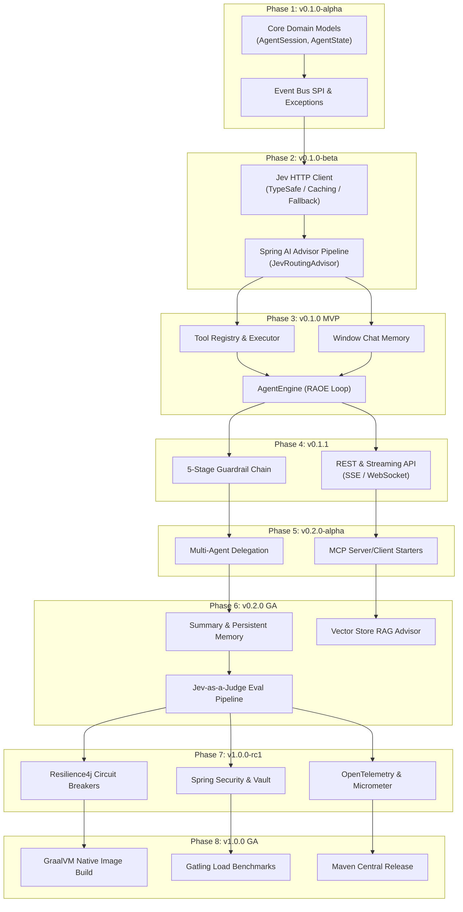

# Implementation Plan — Jev Agent Harness

> **Version:** 0.1.0-draft  
> **Last Updated:** 2026-09-23  
> **Status:** Draft  
> **Companion Documents:** [PRD.md](PRD.md) · [SRS.md](SRS.md) · [TECH_STACK.md](TECH_STACK.md) · [AGENT.md](AGENT.md) · [ARCHITECTURE.md](ARCHITECTURE.md) · [CONTRIBUTING.md](CONTRIBUTING.md)

---

## Table of Contents

1. [Executive Summary & Release Philosophy](#1-executive-summary--release-philosophy)
2. [Master Implementation Roadmap Matrix](#2-master-implementation-roadmap-matrix)
3. [Phase & GitHub Release Version Breakdown](#3-phase--github-release-version-breakdown)
   - [Phase 1: Project Foundation & Core Abstractions (v0.1.0-alpha)](#phase-1-project-foundation--core-abstractions-v010-alpha)
   - [Phase 2: Jev Engine & Advisor Pipeline (v0.1.0-beta)](#phase-2-jev-engine--advisor-pipeline-v010-beta)
   - [Phase 3: Tool System, Memory & Core RAOE Loop (v0.1.0 MVP)](#phase-3-tool-system-memory--core-raoe-loop-v010-mvp)
   - [Phase 4: Guardrail Framework & API Streaming Layer (v0.1.1)](#phase-4-guardrail-framework--api-streaming-layer-v011)
   - [Phase 5: Multi-Agent Orchestration & MCP Integration (v0.2.0-alpha)](#phase-5-multi-agent-orchestration--mcp-integration-v020-alpha)
   - [Phase 6: Summary Memory, RAG & Evaluation Pipeline (v0.2.0)](#phase-6-summary-memory-rag--evaluation-pipeline-v020)
   - [Phase 7: Security Hardening & Observability Stack (v1.0.0-rc1)](#phase-7-security-hardening--observability-stack-v100-rc1)
   - [Phase 8: Production GA & Native Image Release (v1.0.0 GA)](#phase-8-production-ga--native-image-release-v100-ga)
4. [Component Build Order & Dependency Graph](#4-component-build-order--dependency-graph)
5. [Release Verification & Definition of Done (DoD)](#5-release-verification--definition-of-done-dod)

---

## 1. Executive Summary & Release Philosophy

This document outlines the step-by-step implementation strategy for the **Jev Agent Harness**. The development lifecycle is structured around 8 distinct phases, mapped directly to **GitHub Release Versions** following strict Semantic Versioning (`vMAJOR.MINOR.PATCH-STAGE`).

### Release Strategy Principles

- **Iterative Deliverables:** Every GitHub release delivers a runnable, testable artifact with verified contract boundaries.
- **Spec-First Alignment:** All components directly implement specifications established in [PRD.md](PRD.md), [SRS.md](SRS.md), [TECH_STACK.md](TECH_STACK.md), [AGENT.md](AGENT.md), and [ARCHITECTURE.md](ARCHITECTURE.md).
- **Zero-Regression Testing:** Each release phase requires unit test coverage ≥ 85%, integration test validation via Testcontainers, and end-to-end verification.
- **Spring AI Native Integration:** Build directly upon Spring AI 2.0 primitives (`ChatClient`, `CallResponseAdvisor`, `@Tool`, `VectorStore`, MCP SPIs).

---

## 2. Master Implementation Roadmap Matrix

| Phase | GitHub Version | Stage | Main Focus | Target Deliverables | Estimated Duration |
|:---|:---|:---|:---|:---|:---|
| **Phase 1** | `v0.1.0-alpha` | Pre-Alpha | Core Abstractions & Domain Models | Gradle project structure, `AgentSession`, `AgentState`, core event bus, exception hierarchy | 1 Week |
| **Phase 2** | `v0.1.0-beta` | Alpha / Beta | Jev Client & Spring AI Advisor Pipeline | `JevClient` HTTP client, caching & fallback decorators, `JevRoutingAdvisor`, `SystemPromptAdvisor` | 2 Weeks |
| **Phase 3** | `v0.1.0` | **MVP Release** | Tool Framework, Memory & RAOE Agent Engine | `@Tool` scanner & executor, `WindowChatMemory`, `AgentEngine` state machine loop, basic REST endpoints | 2 Weeks |
| **Phase 4** | `v0.1.1` | Patch / Minor | Guardrails, API & Real-Time Streaming | 5-stage `GuardrailChain`, `ToolRiskGate`, SSE (`/stream`) & WebSocket streaming endpoints | 1 Week |
| **Phase 5** | `v0.2.0-alpha` | Alpha | Multi-Agent Delegation & MCP Support | `DelegatingAgentAdvisor`, inter-agent messaging bus, Spring AI MCP server/client starters | 2 Weeks |
| **Phase 6** | `v0.2.0` | **Minor GA** | Advanced Memory, RAG & Eval Pipeline | `SummaryChatMemory`, `pgvector` store integration, `JevAsAJudgeEvaluator`, trajectory evals | 2 Weeks |
| **Phase 7** | `v1.0.0-rc1` | Release Candidate | Security, Resilience & Observability | Resilience4j circuit breakers, Spring Security 7.x, OpenTelemetry spans, Micrometer metrics | 2 Weeks |
| **Phase 8** | `v1.0.0` | **Production GA** | Production Hardening & Native Image | GraalVM native build verification, Gatling load tests, Maven Central publication | 1 Week |

---

## 3. Phase & GitHub Release Version Breakdown

---

### Phase 1: Project Foundation & Core Abstractions (v0.1.0-alpha)

- **GitHub Release Tag:** `v0.1.0-alpha`
- **Development Stage:** Pre-Alpha Foundation
- **Main Focus:** Establish multi-module Gradle project structure, domain primitives, core event interfaces, and configuration schemas.

#### Key Modules & Deliverables

1. **Gradle Build Architecture:**
   - Multi-module setup: `jev-agent-harness-core`, `jev-agent-harness-starter`, `jev-agent-harness-example`.
   - Configure Java 21 toolchain and Spring Boot 4.x plugin in `build.gradle.kts`.
2. **Domain Models (`com.jevharness.core.domain`):**
   - Implement `AgentSession` record (session ID, agent ID, state, message history, metadata).
   - Implement `AgentState` enum (`INITIALIZING`, `REASONING`, `ACTING`, `OBSERVING`, `EVALUATING`, `COMPLETED`, `FAILED`, `CANCELLED`).
   - Implement `AgentExecutionConfig` record (max iterations, timeout, model selection, temperature).
3. **Event System (`com.jevharness.core.event`):**
   - Create `AgentEvent` hierarchy (`AgentStateChangedEvent`, `StepStartedEvent`, `ToolExecutionStartedEvent`, `ToolExecutionCompletedEvent`, `EvaluationCompletedEvent`).
   - Implement `AgentEventBus` SPI and default in-memory reactive listener dispatching.
4. **Exception Hierarchy (`com.jevharness.core.exception`):**
   - Define `AgentException`, `JevClientException`, `ToolExecutionException`, `GuardrailViolationException`, `MaxIterationsExceededException`.

#### Target Class Files
- `com.jevharness.core.domain.AgentSession`
- `com.jevharness.core.domain.AgentState`
- `com.jevharness.core.domain.AgentExecutionConfig`
- `com.jevharness.core.event.AgentEventBus`
- `com.jevharness.core.exception.AgentException`

#### Verification Criteria
- Gradle project compiles cleanly with Java 21.
- Unit tests verify immutable domain record creations and state machine transitions.

---

### Phase 2: Jev Engine & Advisor Pipeline (v0.1.0-beta)

- **GitHub Release Tag:** `v0.1.0-beta`
- **Development Stage:** Beta Preview
- **Main Focus:** Implement Jev decision engine HTTP integration and Spring AI 2.0 `CallResponseAdvisor` pipeline.

#### Key Modules & Deliverables

1. **Jev Client Integration (`com.jevharness.jev`):**
   - `JevClient` interface defining `evaluateChoice()`, `evaluateScore()`, and `evaluateNoul()`.
   - `TypeSafeJevClient`: HTTP/2 client (`java.net.http.HttpClient`) connecting to Jev `/v1/systemone` endpoint.
   - `CachingJevClient`: Redis/ConcurrentHashMap decorator caching identical decision signatures.
   - `FallbackJevClient`: Resilience decorator triggering heuristic fallbacks on Jev service downtime.
   - Jev records: `JevChoiceResult`, `JevScoreResult`, `JevNoulResult`.
2. **Spring AI Advisor Pipeline (`com.jevharness.llm.advisor`):**
   - `JevRoutingAdvisor`: Intercepts `ChatClient` requests to query Jev for sub-500ms intent routing.
   - `SystemPromptAdvisor`: Dynamically builds system prompts enriched with agent instructions and system directives.
3. **ChatClient Factory (`com.jevharness.llm`):**
   - `ChatClientFactory` for constructing configured `ChatClient` instances per provider (OpenAI, Anthropic, Ollama).

#### Target Class Files
- `com.jevharness.jev.JevClient`
- `com.jevharness.jev.TypeSafeJevClient`
- `com.jevharness.jev.CachingJevClient`
- `com.jevharness.jev.FallbackJevClient`
- `com.jevharness.llm.advisor.JevRoutingAdvisor`
- `com.jevharness.llm.ChatClientFactory`

#### Verification Criteria
- WireMock integration tests verifying Jev REST payload serialization/deserialization.
- `JevRoutingAdvisor` correctly decorates LLM calls and logs Jev decision latency.

---

### Phase 3: Tool System, Memory & Core RAOE Loop (v0.1.0 MVP)

- **GitHub Release Tag:** `v0.1.0`
- **Development Stage:** Initial MVP Release
- **Main Focus:** Complete the core Reason → Act → Observe → Evaluate (RAOE) execution loop, Spring AI tool integration, and windowed chat memory.

#### Key Modules & Deliverables

1. **Tool Subsystem (`com.jevharness.tool`):**
   - `@Tool` annotation scanner (`ToolDiscovery`) discovering tool beans in Spring ApplicationContext.
   - `ToolRegistry` for registering, retrieving, and validating tool schemas.
   - `ToolExecutor` for invoking reflection/method handles safely with argument conversion.
   - `ToolArgumentAugmenter` using Jev to refine raw LLM tool parameters before invocation.
2. **Memory Subsystem (`com.jevharness.memory`):**
   - `ChatMemoryManager` SPI.
   - `WindowChatMemory`: Sliding window memory strategy keeping the last $N$ turns.
3. **Agent Engine Core (`com.jevharness.agent`):**
   - `AgentEngine` state machine controlling the RAOE loop.
   - Enforce iteration limit safeguards (`harness.agent.max-iterations`).
   - `AgentSessionManager` for session lifecycle persistence.
4. **Basic REST API (`com.jevharness.api`):**
   - `AgentController`: POST `/v1/agents/run` (synchronous execution endpoint).

#### Target Class Files
- `com.jevharness.tool.ToolRegistry`
- `com.jevharness.tool.ToolExecutor`
- `com.jevharness.memory.WindowChatMemory`
- `com.jevharness.agent.AgentEngine`
- `com.jevharness.api.AgentController`

#### Verification Criteria
- End-to-end integration test of an agent solving a math or weather query using `@Tool`.
- Verify RAOE loop terminates on target output or max iteration boundary.

---

### Phase 4: Guardrail Framework & API Streaming Layer (v0.1.1)

- **GitHub Release Tag:** `v0.1.1`
- **Development Stage:** Patch / Minor Feature Update
- **Main Focus:** Enforce 5-stage guardrail validation and real-time Server-Sent Events (SSE) and WebSocket response streaming.

#### Key Modules & Deliverables

1. **Guardrail Pipeline (`com.jevharness.guardrail`):**
   - `GuardrailChain` managing execution of pre-input, pre-LLM, post-LLM, pre-action, and post-action stages.
   - `InputLengthValidator`: Validates prompt length boundaries.
   - `PiiRedactor`: Redacts PII patterns (SSN, credit card, email) before sending to LLM.
   - `InjectionDetector`: Leverages Jev `Score` / `Noul` to detect prompt injection attempts.
   - `ToolRiskGate`: Evaluates tool risk levels (`LOW`, `MEDIUM`, `HIGH`, `CRITICAL`), requiring human-in-the-loop approval for sensitive operations.
2. **Streaming API Layer (`com.jevharness.api`):**
   - `StreamController`: GET `/v1/agents/{id}/stream` (SSE endpoint emitting token chunks and tool status events).
   - `WebSocketHandler`: `/ws/agent` bi-directional streaming protocol.

#### Target Class Files
- `com.jevharness.guardrail.GuardrailChain`
- `com.jevharness.guardrail.PiiRedactor`
- `com.jevharness.guardrail.InjectionDetector`
- `com.jevharness.guardrail.ToolRiskGate`
- `com.jevharness.api.StreamController`
- `com.jevharness.api.WebSocketHandler`

#### Verification Criteria
- Guardrail blocks simulated prompt injection attacks and redacts PII.
- SSE endpoint streams tokens smoothly with lower than 100ms first-chunk latency.

---

### Phase 5: Multi-Agent Orchestration & MCP Integration (v0.2.0-alpha)

- **GitHub Release Tag:** `v0.2.0-alpha`
- **Development Stage:** Alpha Feature Release
- **Main Focus:** Enable multi-agent hierarchical delegation and Model Context Protocol (MCP) tool sharing.

#### Key Modules & Deliverables

1. **Multi-Agent Engine (`com.jevharness.agent.multi`):**
   - `DelegatingAgentAdvisor`: Intercepts sub-task requests and delegates execution to specialized child agents.
   - Inter-Agent Messaging Bus (`AgentMessageRouter`).
   - Supervisor-Worker orchestration pattern implementation.
2. **Model Context Protocol Integration (`com.jevharness.mcp`):**
   - MCP Client starter integration to consume tools and resources from external MCP servers.
   - MCP Server starter allowing the Jev Agent Harness to expose local `@Tool` beans as standard MCP tools.

#### Target Class Files
- `com.jevharness.agent.multi.DelegatingAgentAdvisor`
- `com.jevharness.agent.multi.AgentMessageRouter`
- `com.jevharness.mcp.JevMcpClientStarter`
- `com.jevharness.mcp.JevMcpServerStarter`

#### Verification Criteria
- Multi-agent test where a supervisor agent delegates sub-tasks to two worker agents.
- Integration test discovering and executing tools provided by an external MCP server.

---

### Phase 6: Summary Memory, RAG & Evaluation Pipeline (v0.2.0)

- **GitHub Release Tag:** `v0.2.0`
- **Development Stage:** Minor GA Release
- **Main Focus:** Advanced memory compaction strategies, vector RAG integration, and automated evaluation framework.

#### Key Modules & Deliverables

1. **Advanced Memory (`com.jevharness.memory`):**
   - `SummaryChatMemory`: Summarizes conversation history past token thresholds using Jev/LLM.
   - `PersistentChatMemory`: Spring Data JDBC repository persisting sessions to PostgreSQL.
2. **RAG Integration (`com.jevharness.rag`):**
   - `VectorStoreAdvisor`: Integrates Spring AI `VectorStore` (PostgreSQL `pgvector`, Qdrant, Milvus) into the ChatClient advisor chain.
   - Document ingestion and retrieval pipeline.
3. **Evaluation Framework (`com.jevharness.eval`):**
   - `JevAsAJudgeEvaluator`: Scores agent trajectory quality, decision accuracy, and tool execution safety.
   - Automated benchmark test suite.

#### Target Class Files
- `com.jevharness.memory.SummaryChatMemory`
- `com.jevharness.memory.PersistentChatMemory`
- `com.jevharness.rag.VectorStoreAdvisor`
- `com.jevharness.eval.JevAsAJudgeEvaluator`

#### Verification Criteria
- Conversation history automatically summarizes when exceeding token threshold.
- `JevAsAJudgeEvaluator` produces repeatable benchmark scores across agent test runs.

---

### Phase 7: Security Hardening & Observability Stack (v1.0.0-rc1)

- **GitHub Release Tag:** `v1.0.0-rc1`
- **Development Stage:** Release Candidate
- **Main Focus:** Production-grade security, enterprise resilience, and full telemetry stack integration.

#### Key Modules & Deliverables

1. **Enterprise Security (`com.jevharness.security`):**
   - Spring Security 7.x integration with OAuth2 Resource Server & JWT validation.
   - Integration with Spring Vault and Kubernetes Secrets for dynamic LLM/Jev API key rotation.
2. **Resilience Stack (`com.jevharness.resilience`):**
   - Resilience4j configuration (Circuit Breaker, Rate Limiter, Retry with exponential backoff).
3. **Observability Stack (`com.jevharness.observability`):**
   - OpenTelemetry span creation for `AgentEngine`, `JevClient`, and `ToolExecutor`.
   - Micrometer custom metrics (`jev.decision.latency`, `agent.run.duration`, `llm.tokens.consumed`).
   - Logback JSON log layout with MDC propagation (`sessionId`, `runId`, `stepId`).
   - Grafana dashboard templates (`grafana-dashboard.json`).

#### Target Class Files
- `com.jevharness.security.AgentSecurityConfig`
- `com.jevharness.resilience.ResilienceConfig`
- `com.jevharness.observability.AgentTracer`
- `com.jevharness.observability.HarnessMetrics`

#### Verification Criteria
- End-to-end trace propagated from REST controller to Jev API and LLM call in OpenTelemetry Tempo/Jaeger.
- Circuit breaker trips automatically on simulated Jev 503 errors and redirects to fallback client.

---

### Phase 8: Production GA & Native Image Release (v1.0.0 GA)

- **GitHub Release Tag:** `v1.0.0`
- **Development Stage:** General Availability (GA)
- **Main Focus:** GraalVM native image compilation, high-concurrency load testing, production documentation, and Maven Central publishing.

#### Key Modules & Deliverables

1. **GraalVM Native Image Optimization:**
   - Add GraalVM hints (`@RegisterReflectionForBinding`) for Jev DTOs, tools, and event records.
   - Native binary compilation verification (`./gradlew nativeCompile`).
2. **Performance Benchmarking:**
   - Gatling load test suite simulating 500 concurrent agent sessions.
   - Verify sub-500ms p99 latency for Jev routing decisions under load.
3. **Artifact Publishing & Documentation:**
   - Publish `jev-agent-harness-spring-boot-starter` to Maven Central.
   - Complete reference documentation, API docs (Javadoc), and user guides.

#### Target Class Files
- `com.jevharness.starter.JevAgentHarnessAutoConfiguration`
- `com.jevharness.starter.nativex.JevRuntimeHints`

#### Verification Criteria
- `./gradlew nativeCompile` produces an executable that boots in < 200ms.
- Gatling load test passes with 0% error rate at 500 concurrent users.

---

## 4. Component Build Order & Dependency Graph

The implementation order enforces a strict bottom-up dependency hierarchy across modules and GitHub release versions:



---

## 5. Release Verification & Definition of Done (DoD)

For a GitHub Release Version tag to be created and published, the release artifact must satisfy the following Quality Gates:

```
+-----------------------------------------------------------------------+
|                    Release Quality Gate Checklist                     |
+-----------------------------------------------------------------------+
|  [ ] 1. Code Compilation: Gradle build succeeds cleanly with 0 warnings. |
|  [ ] 2. Test Coverage: Unit & integration test coverage >= 85%.        |
|  [ ] 3. Static Analysis: Spotless formatting & ArchUnit rules pass.    |
|  [ ] 4. Integration Verification: Testcontainers pass with DB/Redis. |
|  [ ] 5. Contract Adherence: WireMock API tests pass for Jev & LLMs.   |
|  [ ] 6. Documentation: Companion docs updated and Javadoc clean.      |
|  [ ] 7. Tagging: GitHub Release Tag created matching semantic version.|
+-----------------------------------------------------------------------+
```

### Quality Gate Requirements

1. **Automated Testing:** All unit (`./gradlew test`) and integration tests (`./gradlew integrationTest`) pass cleanly.
2. **Code Quality:** Spotless code format check (`./gradlew spotlessCheck`) and ArchUnit package structure rules pass.
3. **Security Scan:** Dependency vulnerability scan (`./gradlew dependencyCheckAnalyze`) returns zero HIGH or CRITICAL CVEs.
4. **Performance SLA:** Jev decision engine p99 latency remains ≤ 500ms under benchmark tests.
5. **Release Notes:** GitHub release notes generated detailing feature additions, breaking changes, and migration steps.

---

> **Summary:** The Jev Agent Harness implementation plan maps development across 8 structured phases and corresponding GitHub release versions from `v0.1.0-alpha` to `v1.0.0 GA`, ensuring an incremental, well-tested, production-ready framework.
