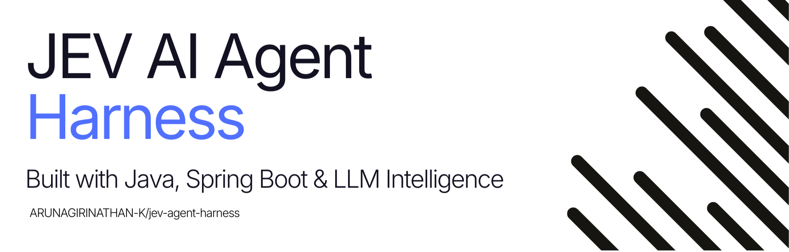

<picture>
  <source
    media="(prefers-color-scheme: dark)"
    srcset="./assets/Top/dark.png"
  />
  <source
    media="(prefers-color-scheme: light)"
    srcset="./assets/Top/light.png"
  />
  
</picture>

---

*A Java Spring Boot framework for building LLM-powered agents with Jev-driven decision intelligence.*

---

**Jev Agent Harness** combines **Spring AI 2.0**'s composable advisor pipeline for LLM orchestration with **Jev** for fast, structured decision-making. By leveraging Jev for routing, classification, and risk-gating, agents become faster, cheaper, and more reliable than LLM-only approaches.


### Why Jev + LLM?

| Capability | LLM (System Two) | Jev (System One) |
|---|---|---|
| Strength | Open-ended reasoning, generation, coding | Fast classification, routing, probabilistic gating |
| Latency | 1–30s | 70–500ms |
| Cost | High (token-based) | Low (decision-based) |
| Hallucination | Possible | Structurally impossible |

By offloading routing and classification to Jev, agents become **faster**, **cheaper**, and **more reliable**.

---
## Key Features

- **Agent Loop** — Reason → Act → Observe → Evaluate cycle with configurable iteration limits
- **Jev Decision Layer** — Sub-500ms routing, classification, and risk-gating
- **Type-Safe Tools** — `@Tool`-annotated methods with schema validation and argument augmentation
- **Composable Memory** — Window, summary, and persistent memory strategies with pluggable backends
- **Guardrail Pipeline** — Pre-input, pre-LLM, post-LLM, pre-action, and post-action validation stages
- **Streaming** — SSE and WebSocket support for real-time responses and tool-call status
- **Observability** — OpenTelemetry traces, Micrometer metrics, and structured JSON logging
- **MCP Support** — Model Context Protocol server and client integration
- **Spring-Native** — Built on Spring AI 2.0's advisor-driven architecture
---

## How It Works


---

## Quick Start

> 🚧 **Coming Soon** — The framework is currently in the specification phase. See the documentation above for the full design.

```bash
git clone https://github.com/ARUNAGIRINATHAN-K/jev-agent-harness.git
cd jev-agent-harness
```
```bash
./gradlew build
```
```bash
./gradlew bootRun
```

---

## Documentation

* [**PRD.md**](docs/PRD.md) — Product Requirements —> features, personas, roadmap
* [**SRS.md**](docs/SRS.md) — Software Requirements — functional & non-functional specs
* [**TECH_STACK.md**](docs/TECH_STACK.md) — Technology Stack — core frameworks, decision engines, libraries & tools
* [**AGENT.md**](docs/AGENT.md) — Agent Behavior — lifecycle, decision points, tool contracts
* [**ARCHITECTURE.md**](docs/ARCHITECTURE.md) — Architecture — system design, package structure, deployment
* [**IMPLEMENTATION_PLAN.md**](docs/IMPLEMENTATION_PLAN.md) — Implementation Plan — phases, GitHub release versions, focus & deliverables

---

## License

This project is licensed under the [Apache License 2.0](LICENSE).
