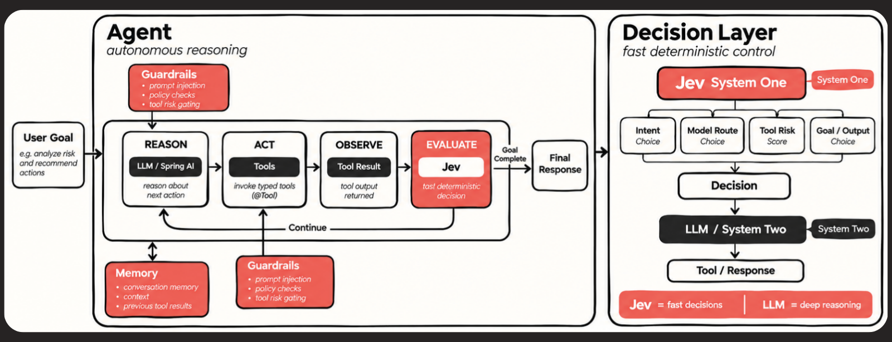
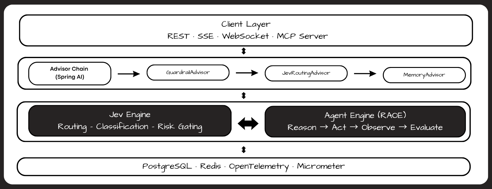

<div align="center">

<picture>
  <source media="(prefers-color-scheme: dark)" src="assets/Top/dark.svg">
  <source media="(prefers-color-scheme: light)" src="assets/Top/light.svg">
</picture>

<picture>
   <source media="(prefers-color-scheme: dark)" srcset="assets/Top/dark.svg">
   
</picture>


*Build Production-Grade AI Agents in Java — Powered by Spring AI & Jev Intelligence*

[](https://openjdk.org/projects/jdk/21/)
[](https://spring.io/projects/spring-boot)
[](https://docs.spring.io/spring-ai/reference/)
[](LICENSE)
[](CONTRIBUTION.md)

**Stop reinventing agent infrastructure.** Jev Agent Harness gives you the production scaffolding tool management, memory, guardrails, observability, and orchestration so you focus on *what your agent does*, not how it runs.

[Quick Start](#-quick-start) · [Features](#-what-you-get) · [Architecture](#-architecture) · [Docs](#-documentation)

</div>

---

The AI agent ecosystem is dominated by Python — **LangChain, CrewAI, AutoGen** leaving Java teams to build bespoke scaffolding or awkwardly port patterns that clash with Spring conventions. 
Even worse, **LLM-only agents are expensive and slow.** Routing a simple yes/no decision through GPT-4 wastes tokens, adds 1–30 seconds of latency, and introduces hallucination risk where none is needed.

## The Jev Solution

**Jev Agent Harness** merges two worlds:

| Layer | Technology | Role |
|:---|:---|:---|
| **System 2 — Deep Thinking** | Spring AI 2.0 + LLM | Complex reasoning, generation, planning |
| **System 1 — Fast Decisions** | Jev (TypeSafe AI) | Routing, classification, risk-gating |

> **Result:** Agents that think deeply *when they must*, and decide instantly *when they can* — faster, cheaper, and more reliable than LLM-only approaches.

---

## How it works ?

<p align="center">
  
</p>

---

## What You Get

<table>
<tr>
<td width="50%">

### Agent Loop (RAOE)
`**Reason → Act → Observe → Evaluate**` — a battle-tested state machine with configurable iteration limits, pause/resume, and graceful degradation.

### Jev Decision Layer
Sub-500ms routing, classification, and risk-gating. The agent's fast brain — no LLM round-trip needed for structured decisions.

### Type-Safe Tools
`@Tool`-annotated methods with JSON Schema validation, argument augmentation, and a first-class tool registry.

### Composable Memory
Window, summary, and persistent memory strategies. Plug in Redis, PostgreSQL, or any Spring AI–compatible backend.

</td>
<td width="50%">

### Guardrail Pipeline
**5 stages:** `Pre-input → Pre-LLM → Post-LLM → Pre-action → Post-action`. Block, warn, or transform at every boundary.

### Real-Time Streaming
SSE and WebSocket endpoints for token-by-token responses, tool-call status updates, and live agent state.

### Full Observability
OpenTelemetry traces, Micrometer metrics, and structured JSON logging — out of the box.

### MCP Support
Model Context Protocol server and client integration following the Spring AI MCP SPI.

</td>
</tr>
</table>

---

## Architecture

The harness uses a **hexagonal architecture** with Spring AI 2.0's composable advisor pipeline at its core:

<p align="center">
  
</p>

---

## Quick Start

```bash
git clone https://github.com/ARUNAGIRINATHAN-K/jev-agent-harness.git
cd jev-agent-harness

./mvnw clean install

./mvnw spring-boot:run
```

> 💡 **Tip:** See [TECH_STACK.md](TECH_STACK.md) for the full list of supported providers and configuration options.

---

<div align="center">

## Documentation

[**PRD.md**](PRD.md) • [**SRS.md**](SRS.md) • [**TECH_STACK.md**](TECH_STACK.md) 
[**AGENT.md**](AGENT.md) • [**ARCHITECTURE.md**](ARCHITECTURE.md) • [**IMPLEMENTATION_PLAN.md**](IMPLEMENTATION_PLAN.md) • [**CONTRIBUTION.md**](CONTRIBUTION.md)

</div>

---

## Why Jev Agent Harness?

<table>
<tr>
<td align="center" width="33%">
<h3>Fast</h3>
Jev handles routing & classification in <b>&lt;500ms</b> — no LLM round-trip for structured decisions.
</td>
<td align="center" width="33%">
<h3>Cost-Efficient</h3>
Offload simple decisions to Jev. Save <b>60–80%</b> on LLM token costs for routing-heavy workloads.
</td>
<td align="center" width="33%">
<h3>Production-Ready</h3>
Guardrails, circuit breakers, observability, and graceful degradation — <b>built in, not bolted on.</b>
</td>
</tr>
<tr>
<td align="center" width="33%">
<h3>Spring-Native</h3>
Built <i>on</i> Spring AI 2.0, not <i>around</i> it. Uses advisors, auto-configuration, and DI — the Spring way.
</td>
<td align="center" width="33%">
<h3>Composable</h3>
Mix and match memory, tools, guardrails, and decision strategies. Every component is pluggable.
</td>
<td align="center" width="33%">
<h3>Well-Documented</h3>
7 comprehensive docs covering product vision through implementation details. No guesswork.
</td>
</tr>
</table>

---

<div align="center">

### ⭐ Star this repo if you believe Java deserves a first-class AI agent framework.

**Built with ❤️ by [Arunagirinathan K](https://github.com/ARUNAGIRINATHAN-K)**

</div>
