# Architecture Document — Jev Agent Harness

> **Version:** 0.1.0-draft  
> **Last Updated:** 2026-09-23  
> **Status:** Draft  
> **Companion Documents:** [PRD.md](PRD.md) · [SRS.md](SRS.md) · [TECH_STACK.md](TECH_STACK.md) · [AGENT.md](AGENT.md)

---

## Table of Contents

1. [High-Level Architecture](#1-high-level-architecture)
2. [Technology Stack](#2-technology-stack)
3. [Package Structure](#3-package-structure)
4. [Spring AI Advisor Pipeline](#4-spring-ai-advisor-pipeline)
5. [Jev Client Architecture](#5-jev-client-architecture)
6. [Tool System Architecture](#6-tool-system-architecture)
7. [Memory Architecture](#7-memory-architecture)
8. [Guardrail Framework](#8-guardrail-framework)
9. [Observability Stack](#9-observability-stack)
10. [API Layer](#10-api-layer)
11. [Configuration Architecture](#11-configuration-architecture)
12. [Security Architecture](#12-security-architecture)
13. [Testing Strategy](#13-testing-strategy)
14. [Deployment Architecture](#14-deployment-architecture)

---

## 1. High-Level Architecture

### 1.1 Context Diagram (C4 Level 1)

Shows the Jev Agent Harness in the context of its surrounding systems.

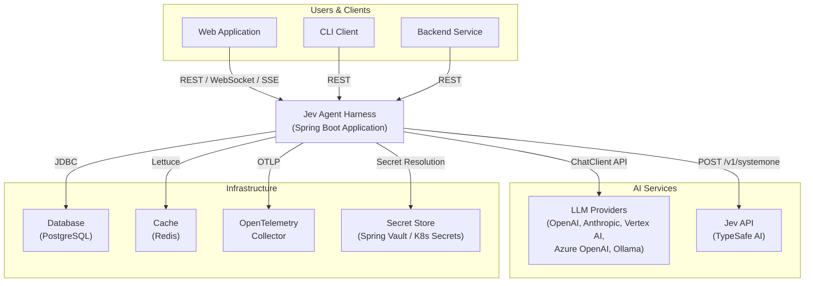

### 1.2 Container Diagram (C4 Level 2)

Shows the major containers within the Jev Agent Harness.

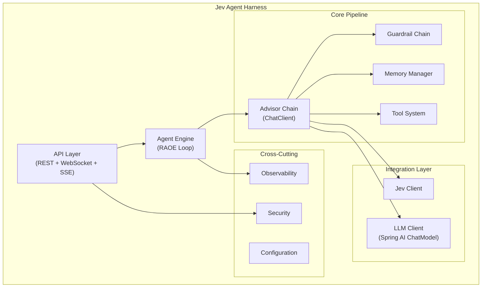

### 1.3 Component Diagram (C4 Level 3)

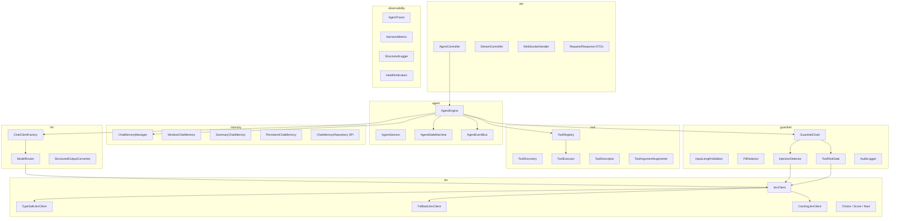

---

## 2. Technology Stack

### 2.1 Core Stack

| Layer | Technology | Version | Purpose |
|:---|:---|:---|:---|
| **Language** | Java | 21+ | Virtual threads, records, pattern matching, sealed classes |
| **Framework** | Spring Boot | 4.x | Application framework, auto-configuration, DI |
| **Spring Framework** | Spring Framework | 7.x | Core IoC, AOP, WebFlux |
| **AI Framework** | Spring AI | 2.0+ | ChatClient, advisors, tool calling, memory, MCP |
| **Build Tool** | Gradle (Kotlin DSL) | 8.x | Build, dependency management, publishing |

### 2.2 Integration

| Concern | Technology | Purpose |
|:---|:---|:---|
| **LLM Communication** | Spring AI ChatModel | Provider-agnostic LLM access |
| **Jev Communication** | Java HttpClient + Jackson | TypeSafe AI System One API |
| **HTTP Client** | java.net.http.HttpClient | Built-in Java HTTP/2 client for Jev |
| **JSON** | Jackson 3 | Serialization/deserialization |
| **Resilience** | Resilience4j | Circuit breaker, retry, rate limiter |

### 2.3 Persistence

| Concern | Technology | Purpose |
|:---|:---|:---|
| **JDBC** | Spring Data JDBC | Relational data access (memory, audit) |
| **Database** | PostgreSQL | Primary relational store (production) |
| **Cache** | Redis (Lettuce) | Jev decision caching, session state |
| **In-Memory** | ConcurrentHashMap | Development/testing default |

### 2.4 Observability

| Concern | Technology | Purpose |
|:---|:---|:---|
| **Tracing** | OpenTelemetry + Micrometer Tracing | Distributed traces |
| **Metrics** | Micrometer | Application metrics |
| **Logging** | SLF4J + Logback (JSON) | Structured logging |
| **Export** | OTLP Exporter | Trace/metric export to backends |
| **Dashboards** | Grafana (templates) | Visualization |

### 2.5 Security

| Concern | Technology | Purpose |
|:---|:---|:---|
| **Authentication** | Spring Security | Endpoint protection |
| **OAuth2** | Spring Security OAuth2 Resource Server | Token-based auth |
| **Secrets** | Spring Vault / Environment Variables | API key management |
| **TLS** | Java KeyStore | Transport encryption |

### 2.6 Testing

| Concern | Technology | Purpose |
|:---|:---|:---|
| **Unit** | JUnit 5 + Mockito | Component testing |
| **Integration** | TestContainers | Database/Redis integration tests |
| **HTTP Mocking** | WireMock | Jev/LLM API mocking |
| **Contract** | Spring Cloud Contract | API contract verification |
| **Load** | Gatling | Performance testing |
| **Assertions** | AssertJ | Fluent assertions |

---

## 3. Package Structure

```
com.jevharness/
├── JevAgentHarnessApplication.java          # Main entry point
│
├── agent/                                    # Agent Engine
│   ├── AgentEngine.java                     # Core RAOE loop orchestrator
│   ├── AgentSession.java                    # Session state and metadata
│   ├── AgentState.java                      # State enum (IDLE, PLANNING, etc.)
│   ├── AgentStateMachine.java               # State transition enforcement
│   ├── AgentEventBus.java                   # Lifecycle event publisher
│   ├── AgentConfiguration.java              # Agent bean configuration
│   └── event/                               # Event types
│       ├── AgentEvent.java                  # Base event
│       ├── StateTransitionEvent.java
│       ├── IterationEvent.java
│       └── CompletionEvent.java
│
├── jev/                                      # Jev Integration
│   ├── JevClient.java                       # Core interface
│   ├── TypeSafeJevClient.java               # HTTP implementation
│   ├── FallbackJevClient.java               # LLM-based fallback
│   ├── CachingJevClient.java                # Memoization decorator
│   ├── JevAutoConfiguration.java            # Spring auto-config
│   ├── JevProperties.java                   # Configuration properties
│   ├── JevHealthIndicator.java              # Actuator health check
│   ├── model/                               # Jev data types
│   │   ├── JevRequest.java                  # API request
│   │   ├── JevResponse.java                 # API response
│   │   ├── Choice.java                      # Choice primitive builder
│   │   ├── Score.java                       # Score primitive builder
│   │   ├── Noul.java                        # Noul primitive builder
│   │   └── JevDecision.java                 # Parsed decision result
│   └── advisor/                             # Spring AI advisors
│       ├── JevRoutingAdvisor.java           # Model routing via Jev
│       └── JevEvaluationAdvisor.java        # Loop termination via Jev
│
├── llm/                                      # LLM Integration
│   ├── ChatClientFactory.java               # ChatClient builder
│   ├── ModelRouter.java                     # Model selection logic
│   ├── ModelRouterProperties.java           # Routing configuration
│   └── StructuredOutputHelper.java          # Output schema utilities
│
├── tool/                                     # Tool System
│   ├── ToolRegistry.java                    # Tool storage and lookup
│   ├── ToolDiscovery.java                   # Classpath scanner for @Tool
│   ├── ToolExecutor.java                    # Managed tool invocation
│   ├── ToolDescriptor.java                  # Tool metadata + schema
│   ├── ToolArgumentAugmenter.java           # SPI for arg augmentation
│   ├── ToolAutoConfiguration.java           # Auto-config
│   └── ToolProperties.java                  # Configuration
│
├── memory/                                   # Memory System
│   ├── ChatMemoryManager.java               # Strategy orchestrator
│   ├── WindowChatMemory.java                # Window strategy
│   ├── SummaryChatMemory.java               # Summary strategy
│   ├── PersistentChatMemory.java            # Persistent strategy
│   ├── ChatMemoryRepository.java            # Storage SPI
│   ├── InMemoryChatMemoryRepository.java    # In-memory impl
│   ├── JdbcChatMemoryRepository.java        # JDBC impl
│   ├── RedisChatMemoryRepository.java       # Redis impl
│   ├── MemoryAutoConfiguration.java         # Auto-config
│   └── MemoryProperties.java               # Configuration
│
├── guardrail/                                # Guardrail Framework
│   ├── GuardrailChain.java                  # Ordered pipeline executor
│   ├── Guardrail.java                       # Guardrail interface
│   ├── GuardrailResult.java                 # Result record
│   ├── GuardrailStage.java                  # Stage enum
│   ├── GuardrailAutoConfiguration.java      # Auto-config
│   ├── GuardrailProperties.java             # Configuration
│   ├── builtin/                             # Built-in guardrails
│   │   ├── InputLengthValidator.java
│   │   ├── PiiRedactor.java
│   │   ├── InjectionDetector.java           # Jev-powered
│   │   ├── TokenBudgetEnforcer.java
│   │   ├── OutputFormatValidator.java
│   │   ├── ToolPermissionChecker.java
│   │   ├── ToolRiskGate.java                # Jev-powered
│   │   ├── ResultSanitizer.java
│   │   └── AuditLogger.java
│   └── advisor/
│       └── GuardrailAdvisor.java            # ChatClient advisor wrapper
│
├── observability/                            # Observability
│   ├── AgentTracer.java                     # OpenTelemetry trace manager
│   ├── HarnessMetrics.java                  # Micrometer metric registry
│   ├── StructuredLogger.java                # JSON log formatter
│   ├── TrajectoryRecorder.java              # Full trajectory capture
│   ├── ObservabilityAutoConfiguration.java  # Auto-config
│   └── advisor/
│       └── ObservabilityAdvisor.java        # ChatClient advisor
│
├── api/                                      # API Layer
│   ├── AgentController.java                 # REST endpoints
│   ├── StreamController.java                # SSE endpoints
│   ├── AgentWebSocketHandler.java           # WebSocket handler
│   ├── dto/                                 # Data Transfer Objects
│   │   ├── AgentRequest.java
│   │   ├── AgentResponse.java
│   │   ├── MessageRequest.java
│   │   ├── TrajectoryDto.java
│   │   ├── StreamEvent.java
│   │   └── ErrorResponse.java
│   ├── ApiAutoConfiguration.java
│   └── GlobalExceptionHandler.java          # Error handling
│
├── config/                                   # Configuration
│   ├── HarnessAutoConfiguration.java        # Master auto-config
│   ├── HarnessProperties.java              # Root config properties
│   ├── SecurityConfiguration.java           # Spring Security config
│   └── WebSocketConfiguration.java          # WebSocket config
│
└── exception/                                # Exception Hierarchy
    ├── HarnessException.java                # Base exception
    ├── AgentExecutionException.java
    ├── JevClientException.java
    ├── JevUnavailableException.java
    ├── ToolExecutionException.java
    ├── ToolTimeoutException.java
    ├── GuardrailBlockException.java
    ├── ContextOverflowException.java
    ├── MaxIterationsException.java
    └── ConfigurationException.java
```

### 3.1 Module Dependency Graph

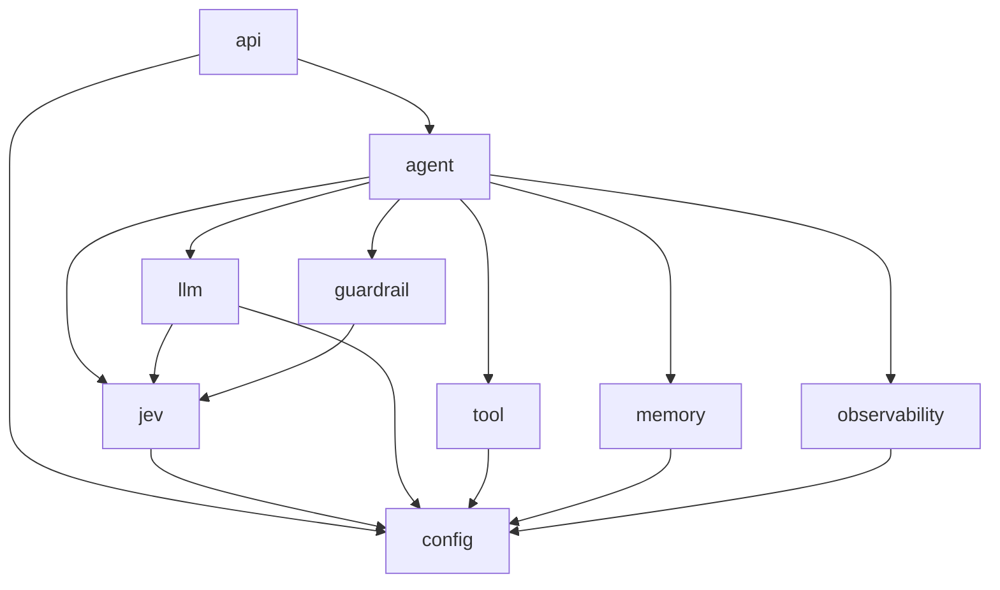

**Key Principles:**
- `agent` depends on all feature modules but feature modules do not depend on each other
- `jev` is a standalone module usable without the full harness
- All modules depend on `config` for properties
- `api` is the entry point, depending only on `agent` and `config`

---

## 4. Spring AI Advisor Pipeline

### 4.1 Advisor Chain Architecture

The `ChatClient` in Spring AI 2.0 uses an ordered chain of advisors that intercept and transform requests and responses. The Jev Agent Harness configures the following advisor chain:

```mermaid
sequenceDiagram
    participant Client as ChatClient.call()
    participant OA as ObservabilityAdvisor
    participant GA as GuardrailAdvisor
    participant MA as MemoryAdvisor
    participant JA as JevRoutingAdvisor
    participant TA as ToolCallingAdvisor
    participant LLM as ChatModel

    Client->>OA: request (start span)
    OA->>GA: request (pre-input guardrails)
    GA->>MA: request (inject history)
    MA->>JA: request (route model)
    JA->>TA: request (with selected model)
    TA->>LLM: request (send to LLM)
    LLM-->>TA: response (with tool calls)

    rect rgb(50, 50, 70)
        Note over TA,LLM: Tool Calling Loop (recursive)
        TA->>TA: execute tool(s)
        TA->>LLM: tool results
        LLM-->>TA: response (final or more tools)
    end

    TA-->>JA: response
    JA-->>MA: response
    MA->>MA: save to memory
    MA-->>GA: response (post-output guardrails)
    GA-->>OA: response (end span, record metrics)
    OA-->>Client: response
```

### 4.2 Advisor Registration Order

Advisors are registered with explicit ordering to ensure correct composition:

```java
@Configuration
public class AdvisorChainConfiguration {

    @Bean
    public ChatClient chatClient(
        ChatModel chatModel,
        ObservabilityAdvisor observabilityAdvisor,
        GuardrailAdvisor guardrailAdvisor,
        MessageChatMemoryAdvisor memoryAdvisor,
        JevRoutingAdvisor jevRoutingAdvisor,
        ToolCallingAdvisor toolCallingAdvisor
    ) {
        return ChatClient.builder(chatModel)
            .defaultAdvisors(
                observabilityAdvisor,      // Order 0 — outermost (tracing)
                guardrailAdvisor,          // Order 100 — validation
                memoryAdvisor,             // Order 200 — context enrichment
                jevRoutingAdvisor,         // Order 300 — model selection
                toolCallingAdvisor         // Order 400 — tool execution (innermost)
            )
            .build();
    }
}
```

### 4.3 Custom Advisor SPI

Developers can inject custom advisors into the chain:

```java
@Component
@Order(150) // Between guardrails (100) and memory (200)
public class CustomLoggingAdvisor implements CallAdvisor {

    @Override
    public AdvisedResponse adviseCall(AdvisedRequest request, CallAdvisorChain chain) {
        log.info("Request: {}", request.userText());
        AdvisedResponse response = chain.nextAroundCall(request);
        log.info("Response: {}", response.result().getOutput().getText());
        return response;
    }

    @Override
    public String getName() {
        return "CustomLoggingAdvisor";
    }

    @Override
    public int getOrder() {
        return 150;
    }
}
```

---

## 5. Jev Client Architecture

### 5.1 Client Hierarchy

The Jev client follows a **decorator pattern** with cascading fallback:

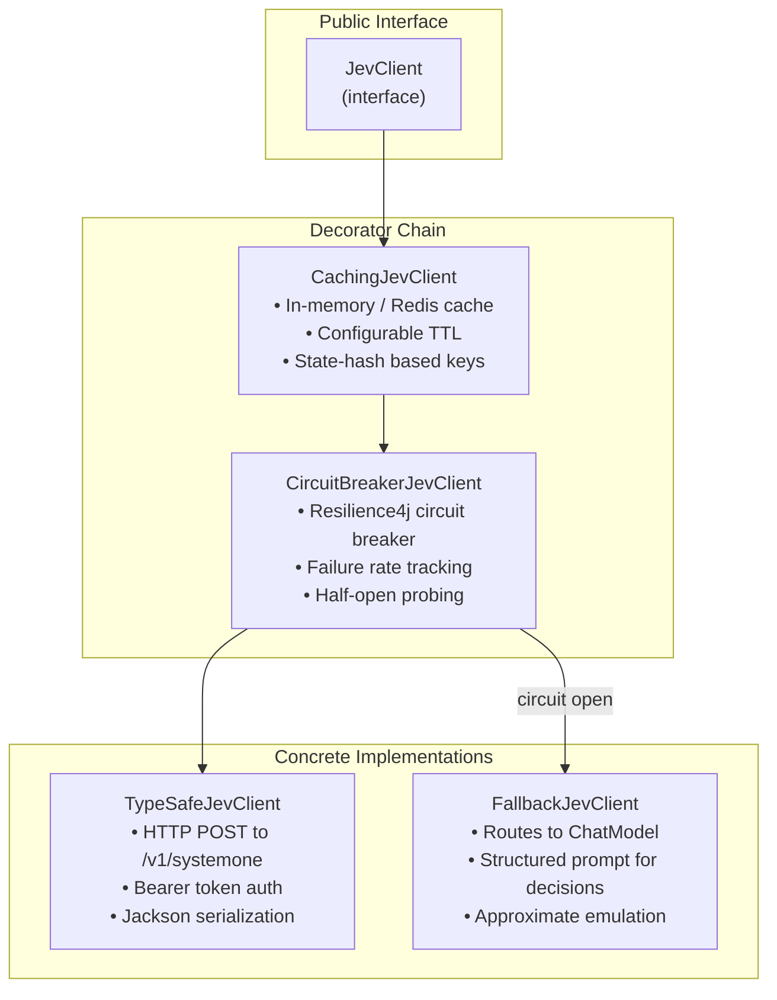

### 5.2 TypeSafeJevClient Implementation

```java
public class TypeSafeJevClient implements JevClient {

    private final HttpClient httpClient;
    private final ObjectMapper objectMapper;
    private final JevProperties properties;
    private final MeterRegistry meterRegistry;

    @Override
    public JevResponse decide(String state, Map<String, JevQuestion> questions) {
        var timer = Timer.start(meterRegistry);

        JevRequest request = new JevRequest(
            properties.getModel(),      // "jev-latest"
            state,
            questions
        );

        HttpRequest httpRequest = HttpRequest.newBuilder()
            .uri(URI.create(properties.getEndpoint()))  // https://api.typesafe.ai/v1/systemone
            .header("Authorization", "Bearer " + properties.getApiKey())
            .header("Content-Type", "application/json")
            .POST(HttpRequest.BodyPublishers.ofString(
                objectMapper.writeValueAsString(request)
            ))
            .timeout(properties.getTimeout())  // default: 2000ms
            .build();

        HttpResponse<String> httpResponse = httpClient.send(
            httpRequest, HttpResponse.BodyHandlers.ofString()
        );

        JevResponse response = objectMapper.readValue(
            httpResponse.body(), JevResponse.class
        );

        timer.stop(meterRegistry.timer("harness.jev.latency",
            "model", properties.getModel(),
            "status", String.valueOf(httpResponse.statusCode())
        ));

        return response;
    }
}
```

### 5.3 Auto-Configuration

```java
@AutoConfiguration
@EnableConfigurationProperties(JevProperties.class)
@ConditionalOnProperty(prefix = "jev", name = "enabled", havingValue = "true", matchIfMissing = true)
public class JevAutoConfiguration {

    @Bean
    @ConditionalOnMissingBean
    public JevClient jevClient(JevProperties properties, MeterRegistry meterRegistry,
                                ObjectMapper objectMapper, ChatModel chatModel) {

        TypeSafeJevClient primary = new TypeSafeJevClient(
            HttpClient.newHttpClient(), objectMapper, properties, meterRegistry
        );

        FallbackJevClient fallback = new FallbackJevClient(chatModel, objectMapper);

        CircuitBreakerJevClient resilient = new CircuitBreakerJevClient(
            primary, fallback, properties.getResilience()
        );

        return new CachingJevClient(resilient, properties.getCache());
    }

    @Bean
    public JevHealthIndicator jevHealthIndicator(JevClient jevClient) {
        return new JevHealthIndicator(jevClient);
    }
}
```

### 5.4 Configuration Properties

```yaml
jev:
  enabled: true
  api-key: ${JEV_API_KEY}                    # REQUIRED — never hardcode
  endpoint: https://api.typesafe.ai/v1/systemone
  model: jev-latest
  timeout: 2000ms

  cache:
    enabled: true
    ttl: 300s                                 # 5 minutes
    max-size: 1000                            # max cached decisions
    backend: IN_MEMORY                        # IN_MEMORY or REDIS

  resilience:
    circuit-breaker:
      failure-rate-threshold: 50              # percentage
      wait-duration-in-open-state: 30s
      permitted-calls-in-half-open: 3
      sliding-window-size: 10
    retry:
      max-attempts: 2
      initial-delay: 500ms
      multiplier: 2.0
```

---

## 6. Tool System Architecture

### 6.1 Component Interactions

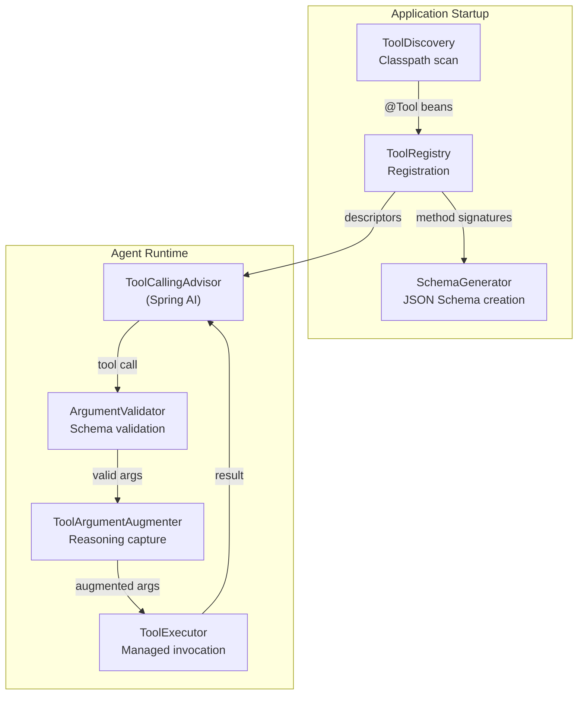

### 6.2 Progressive Tool Disclosure

When the number of registered tools exceeds `harness.tools.search-threshold` (default: 20), the system activates **ToolSearchToolCallingAdvisor**:

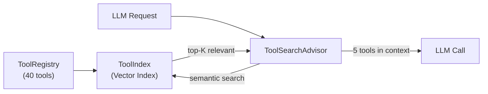

This prevents context overflow from injecting 40+ tool schemas into every prompt.

---

## 7. Memory Architecture

### 7.1 Memory Strategy Pattern

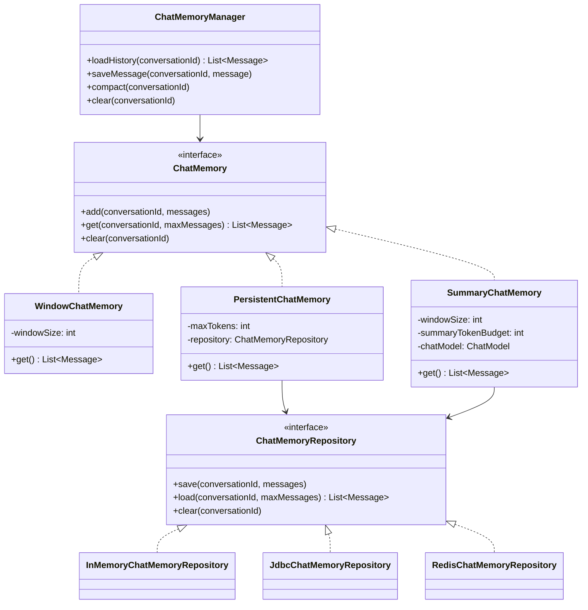

### 7.2 Database Schema (JDBC Backend)

```sql
CREATE TABLE conversation_messages (
    id              UUID PRIMARY KEY DEFAULT gen_random_uuid(),
    conversation_id VARCHAR(255) NOT NULL,
    role            VARCHAR(20)  NOT NULL,  -- SYSTEM, USER, ASSISTANT, TOOL
    content         TEXT         NOT NULL,
    tool_call_id    VARCHAR(255),
    sequence_number INT          NOT NULL,
    token_count     INT,
    created_at      TIMESTAMP    NOT NULL DEFAULT now(),

    INDEX idx_conversation_seq (conversation_id, sequence_number)
);

CREATE TABLE conversation_summaries (
    id              UUID PRIMARY KEY DEFAULT gen_random_uuid(),
    conversation_id VARCHAR(255) NOT NULL UNIQUE,
    summary_text    TEXT         NOT NULL,
    messages_covered INT         NOT NULL,  -- count of messages summarized
    token_count     INT,
    created_at      TIMESTAMP    NOT NULL DEFAULT now(),
    updated_at      TIMESTAMP    NOT NULL DEFAULT now()
);
```

---

## 8. Guardrail Framework

### 8.1 Framework Design

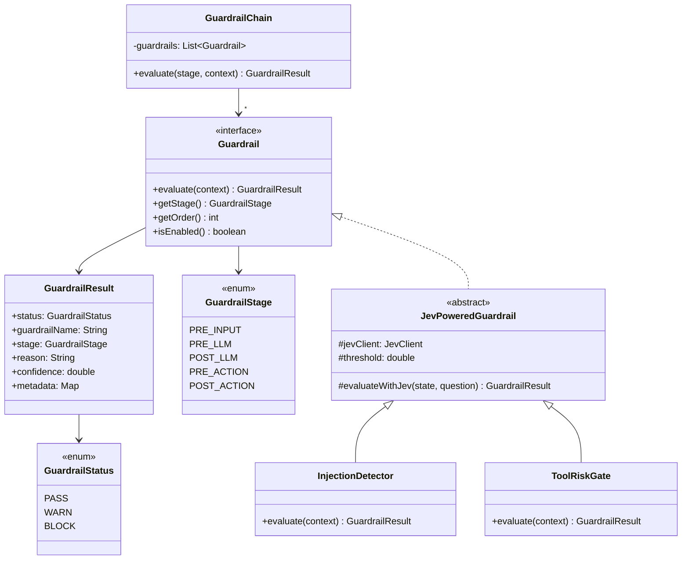

### 8.2 GuardrailAdvisor Integration

The `GuardrailAdvisor` wraps the `GuardrailChain` as a Spring AI advisor:

```java
@Component
public class GuardrailAdvisor implements CallAdvisor {

    private final GuardrailChain guardrailChain;

    @Override
    public AdvisedResponse adviseCall(AdvisedRequest request, CallAdvisorChain chain) {
        // PRE_INPUT check
        GuardrailResult inputCheck = guardrailChain.evaluate(
            GuardrailStage.PRE_INPUT,
            GuardrailContext.ofInput(request.userText())
        );

        if (inputCheck.status() == GuardrailStatus.BLOCK) {
            throw new GuardrailBlockException(inputCheck);
        }

        // Continue chain (memory → routing → tools → LLM)
        AdvisedResponse response = chain.nextAroundCall(request);

        // POST_OUTPUT check
        GuardrailResult outputCheck = guardrailChain.evaluate(
            GuardrailStage.POST_LLM,
            GuardrailContext.ofOutput(response.result().getOutput().getText())
        );

        if (outputCheck.status() == GuardrailStatus.BLOCK) {
            throw new GuardrailBlockException(outputCheck);
        }

        return response;
    }
}
```

---

## 9. Observability Stack

### 9.1 Three Pillars

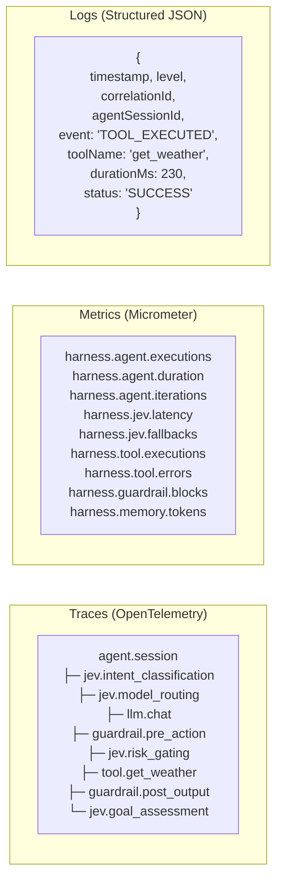

### 9.2 Trace Structure

Each agent session produces a single parent span with child spans for every operation:

```
agent.session (span)
├── agent.iteration[0] (span)
│   ├── guardrail.pre_input (span)
│   │   └── jev.noul.injection_detection (span)
│   ├── jev.choice.intent_classification (span)
│   ├── jev.choice.model_routing (span)
│   ├── memory.load (span)
│   ├── llm.chat (span)
│   ├── guardrail.pre_action (span)
│   │   └── jev.noul.risk_gating (span)
│   ├── tool.get_weather (span)
│   ├── memory.save (span)
│   └── jev.noul.goal_assessment (span)
├── agent.iteration[1] (span)
│   ├── llm.chat (span)
│   ├── guardrail.post_output (span)
│   └── jev.noul.goal_assessment (span)
└── agent.completion (span)
```

### 9.3 Metric Definitions

| Metric Name | Type | Tags | Description |
|:---|:---|:---|:---|
| `harness.agent.executions` | Counter | `status`, `model` | Total agent executions |
| `harness.agent.duration` | Timer | `status`, `model` | Agent execution duration |
| `harness.agent.iterations` | Distribution Summary | `agent_id` | Iterations per execution |
| `harness.jev.latency` | Timer | `model`, `decision_type`, `status` | Jev API call latency |
| `harness.jev.fallbacks` | Counter | `reason` | Fallback activations |
| `harness.jev.cache.hits` | Counter | — | Cache hit count |
| `harness.jev.cache.misses` | Counter | — | Cache miss count |
| `harness.tool.executions` | Counter | `tool_name`, `status` | Tool invocations |
| `harness.tool.duration` | Timer | `tool_name`, `status` | Tool execution time |
| `harness.guardrail.evaluations` | Counter | `stage`, `guardrail`, `status` | Guardrail checks |
| `harness.guardrail.blocks` | Counter | `stage`, `guardrail` | Blocked requests |
| `harness.memory.tokens` | Gauge | `strategy`, `conversation_id` | Current memory token usage |
| `harness.llm.tokens` | Counter | `model`, `direction` | Token usage (prompt/completion) |

### 9.4 Health Indicators

```java
@Component
public class JevHealthIndicator extends AbstractHealthIndicator {

    private final JevClient jevClient;

    @Override
    protected void doHealthCheck(Health.Builder builder) {
        try {
            // Lightweight health check using a trivial Noul question
            JevResponse response = jevClient.noul(
                "health check", "ping", "Is this a valid request?"
            );
            builder.up()
                .withDetail("model", response.model())
                .withDetail("latencyMs", response.latencyMs());
        } catch (JevUnavailableException e) {
            builder.down()
                .withDetail("error", e.getMessage())
                .withDetail("fallback", "active");
        }
    }
}
```

---

## 10. API Layer

### 10.1 REST Controller

```java
@RestController
@RequestMapping("/api/v1/agents")
public class AgentController {

    private final AgentEngine agentEngine;

    @PostMapping
    public ResponseEntity<AgentResponse> createAndRun(@RequestBody AgentRequest request) {
        AgentSession session = agentEngine.execute(request);
        return ResponseEntity.ok(AgentResponse.from(session));
    }

    @GetMapping("/{id}")
    public ResponseEntity<AgentSession> getSession(@PathVariable String id) {
        return ResponseEntity.ok(agentEngine.getSession(id));
    }

    @GetMapping("/{id}/trajectory")
    public ResponseEntity<TrajectoryDto> getTrajectory(@PathVariable String id) {
        return ResponseEntity.ok(agentEngine.getTrajectory(id));
    }

    @PostMapping("/{id}/messages")
    public ResponseEntity<AgentResponse> sendMessage(
        @PathVariable String id,
        @RequestBody MessageRequest message
    ) {
        AgentSession session = agentEngine.continueSession(id, message);
        return ResponseEntity.ok(AgentResponse.from(session));
    }

    @PostMapping("/{id}/pause")
    public ResponseEntity<AgentSession> pause(@PathVariable String id) {
        return ResponseEntity.ok(agentEngine.pause(id));
    }

    @PostMapping("/{id}/resume")
    public ResponseEntity<AgentSession> resume(@PathVariable String id) {
        return ResponseEntity.ok(agentEngine.resume(id));
    }

    @DeleteMapping("/{id}")
    public ResponseEntity<Void> cancel(@PathVariable String id) {
        agentEngine.cancel(id);
        return ResponseEntity.noContent().build();
    }
}
```

### 10.2 SSE Streaming

```java
@RestController
@RequestMapping("/api/v1/agents")
public class StreamController {

    private final AgentEngine agentEngine;

    @GetMapping(value = "/{id}/stream", produces = MediaType.TEXT_EVENT_STREAM_VALUE)
    public Flux<ServerSentEvent<StreamEvent>> stream(@PathVariable String id) {
        return agentEngine.streamSession(id)
            .map(event -> ServerSentEvent.<StreamEvent>builder()
                .id(event.id())
                .event(event.type().name())  // TEXT_DELTA, TOOL_CALL_START, etc.
                .data(event)
                .build());
    }
}
```

### 10.3 WebSocket Handler

```java
@Component
public class AgentWebSocketHandler extends TextWebSocketHandler {

    private final AgentEngine agentEngine;

    @Override
    protected void handleTextMessage(WebSocketSession session, TextMessage message) {
        AgentRequest request = objectMapper.readValue(
            message.getPayload(), AgentRequest.class
        );

        agentEngine.streamSession(request)
            .subscribe(
                event -> session.sendMessage(
                    new TextMessage(objectMapper.writeValueAsString(event))
                ),
                error -> session.sendMessage(
                    new TextMessage(objectMapper.writeValueAsString(
                        StreamEvent.error(error.getMessage())
                    ))
                ),
                () -> session.close()
            );
    }
}
```

### 10.4 OpenAPI Documentation

The API layer auto-generates OpenAPI 3.1 documentation via SpringDoc:

```yaml
# build.gradle.kts
dependencies {
    implementation("org.springdoc:springdoc-openapi-starter-webflux-ui:2.8.0")
}
```

Access: `GET /swagger-ui.html` or `GET /v3/api-docs`

---

## 11. Configuration Architecture

### 11.1 Configuration Hierarchy

```
application.yml (defaults)
├── application-{profile}.yml (environment overrides)
├── Environment Variables (deployment overrides)
└── Spring Cloud Config (centralized, if configured)
```

### 11.2 Complete Configuration Reference

```yaml
# =============================================================================
# Jev Agent Harness — Configuration Reference
# =============================================================================

# --- Jev Integration ---
jev:
  enabled: true
  api-key: ${JEV_API_KEY}
  endpoint: https://api.typesafe.ai/v1/systemone
  model: jev-latest
  timeout: 2000ms
  cache:
    enabled: true
    ttl: 300s
    max-size: 1000
    backend: IN_MEMORY                        # IN_MEMORY | REDIS
  resilience:
    circuit-breaker:
      failure-rate-threshold: 50
      wait-duration-in-open-state: 30s
      permitted-calls-in-half-open: 3
      sliding-window-size: 10

# --- Agent Engine ---
harness:
  agent:
    max-iterations: 10
    goal-confidence-threshold: 0.85           # Jev Noul threshold for goal completion
    enable-jev-routing: true                  # Use Jev for model routing
    enable-jev-evaluation: true               # Use Jev for loop termination

  # --- Memory ---
  memory:
    strategy: WINDOW                          # WINDOW | SUMMARY | PERSISTENT
    window-size: 20
    max-tokens: 4096
    summary-max-tokens: 512
    backend: IN_MEMORY                        # IN_MEMORY | JDBC | REDIS

  # --- Tools ---
  tools:
    default-timeout: 30s
    parallel-execution: true
    search-threshold: 20                      # Activate ToolSearchAdvisor above this count
    max-concurrent-tools: 5

  # --- Guardrails ---
  guardrails:
    enabled: true
    max-input-length: 10000
    injection-detection:
      enabled: true
      threshold: 0.7
    pii-redaction:
      enabled: true
      patterns: [EMAIL, SSN, CREDIT_CARD, PHONE]
    tool-risk-gating:
      enabled: true
      threshold: 0.3
    content-policy:
      enabled: false
    hallucination-detection:
      enabled: false

  # --- Observability ---
  observability:
    tracing:
      enabled: true
      sample-rate: 1.0                        # 0.0 to 1.0
    metrics:
      enabled: true
    trajectory-recording:
      enabled: true

  # --- Retry ---
  retry:
    llm:
      max-attempts: 3
      initial-delay: 1000ms
      multiplier: 2.0
      max-delay: 10000ms
    jev:
      max-attempts: 2
      initial-delay: 500ms
      multiplier: 2.0
      max-delay: 5000ms
    tools:
      max-attempts: 2
      initial-delay: 500ms

# --- Spring AI (provider-specific) ---
spring:
  ai:
    openai:
      api-key: ${OPENAI_API_KEY}
      chat:
        model: gpt-4o
    # anthropic:
    #   api-key: ${ANTHROPIC_API_KEY}
    # vertex-ai:
    #   project-id: ${GCP_PROJECT_ID}
```

### 11.3 Configuration Metadata

All properties are annotated with `@ConfigurationProperties` and generate `spring-configuration-metadata.json` for IDE auto-completion:

```java
@ConfigurationProperties(prefix = "jev")
public record JevProperties(
    boolean enabled,
    @NotBlank String apiKey,
    @NotBlank String endpoint,
    String model,
    Duration timeout,
    CacheProperties cache,
    ResilienceProperties resilience
) {
    public JevProperties {
        if (endpoint == null) endpoint = "https://api.typesafe.ai/v1/systemone";
        if (model == null) model = "jev-latest";
        if (timeout == null) timeout = Duration.ofMillis(2000);
    }
}
```

---

## 12. Security Architecture

### 12.1 Security Layers

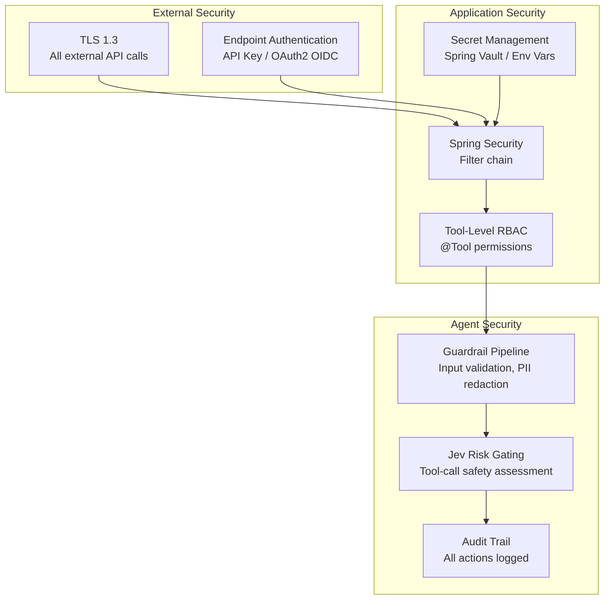

### 12.2 Authentication Configuration

```java
@Configuration
@EnableWebSecurity
public class SecurityConfiguration {

    @Bean
    public SecurityFilterChain filterChain(HttpSecurity http) throws Exception {
        return http
            .csrf(csrf -> csrf.disable())
            .authorizeHttpRequests(auth -> auth
                .requestMatchers("/actuator/health/**").permitAll()
                .requestMatchers("/swagger-ui/**", "/v3/api-docs/**").permitAll()
                .requestMatchers("/api/v1/**").authenticated()
                .requestMatchers("/ws/**").authenticated()
            )
            .oauth2ResourceServer(oauth2 -> oauth2.jwt(Customizer.withDefaults()))
            .httpBasic(Customizer.withDefaults())  // fallback for API key
            .build();
    }
}
```

### 12.3 Secret Management

| Secret | Source | Never In |
|:---|:---|:---|
| `jev.api-key` | Environment variable `JEV_API_KEY` | Source code, logs, traces |
| `spring.ai.openai.api-key` | Environment variable `OPENAI_API_KEY` | Source code, logs, traces |
| Database credentials | K8s secrets / Spring Vault | Source code, logs |

---

## 13. Testing Strategy

### 13.1 Test Pyramid

```
          ╱─────────╲
         ╱   E2E     ╲         ← Gatling load tests, full flow
        ╱─────────────╲
       ╱  Integration   ╲      ← TestContainers + WireMock
      ╱───────────────────╲
     ╱     Contract         ╲   ← Spring Cloud Contract
    ╱─────────────────────────╲
   ╱          Unit              ╲ ← JUnit 5 + Mockito
  ╱───────────────────────────────╲
```

### 13.2 Test Support Infrastructure

```java
// @HarnessTest — bootstraps a test harness with mock clients
@HarnessTest
class AgentEngineTest {

    @Autowired AgentEngine engine;
    @MockBean JevClient jevClient;     // Auto-mocked
    @MockBean ChatModel chatModel;     // Auto-mocked

    @Test
    void shouldRouteViaJev() {
        // Given
        when(jevClient.choice(any(), eq("model"), any(), any()))
            .thenReturn(JevResponse.choice("model", "gpt-4o-mini", 0.91));

        when(chatModel.call(any()))
            .thenReturn(ChatResponse.of("The weather is 15°C"));

        // When
        AgentResponse response = engine.execute(AgentRequest.of("What's the weather?"));

        // Then
        assertThat(response.status()).isEqualTo(AgentState.COMPLETED);
        verify(jevClient).choice(any(), eq("model"), any(), any());
    }
}
```

### 13.3 WireMock Stubs for Jev

```java
@WireMockTest(httpPort = 8089)
class JevClientIntegrationTest {

    @Test
    void shouldHandleJevResponse(WireMockRuntimeInfo wmInfo) {
        stubFor(post("/v1/systemone")
            .willReturn(okJson("""
                {
                    "id": "dec_test",
                    "model": "jev-latest",
                    "decisions": {
                        "intent": {
                            "type": "choice",
                            "value": "question_answering",
                            "probabilities": {
                                "question_answering": 0.87,
                                "task_execution": 0.13
                            }
                        }
                    }
                }
                """)));

        JevClient client = new TypeSafeJevClient(/* ... */);
        JevResponse response = client.choice("Hello", "intent", "Classify intent",
            Map.of("question_answering", "Q&A", "task_execution", "Actions"));

        assertThat(response.choiceValue("intent")).isEqualTo("question_answering");
    }
}
```

### 13.4 TestContainers for Memory

```java
@Testcontainers
@SpringBootTest
class JdbcChatMemoryRepositoryTest {

    @Container
    static PostgreSQLContainer<?> postgres = new PostgreSQLContainer<>("postgres:16");

    @DynamicPropertySource
    static void configureProperties(DynamicPropertyRegistry registry) {
        registry.add("spring.datasource.url", postgres::getJdbcUrl);
        registry.add("spring.datasource.username", postgres::getUsername);
        registry.add("spring.datasource.password", postgres::getPassword);
    }

    @Autowired JdbcChatMemoryRepository repository;

    @Test
    void shouldPersistAndRetrieveMessages() {
        repository.save("conv-1", List.of(
            Message.user("Hello"),
            Message.assistant("Hi there!")
        ));

        List<Message> loaded = repository.load("conv-1", 10);
        assertThat(loaded).hasSize(2);
    }
}
```

---

## 14. Deployment Architecture

### 14.1 Container Architecture

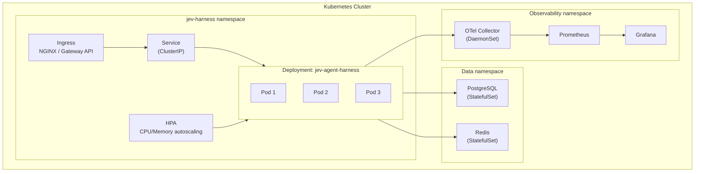

### 14.2 Dockerfile

```dockerfile
# Multi-stage build
FROM eclipse-temurin:21-jdk AS builder
WORKDIR /app
COPY gradle/ gradle/
COPY gradlew build.gradle.kts settings.gradle.kts ./
RUN ./gradlew dependencies --no-daemon
COPY src/ src/
RUN ./gradlew bootJar --no-daemon -x test

FROM eclipse-temurin:21-jre
WORKDIR /app
COPY --from=builder /app/build/libs/*.jar app.jar

# Non-root user
RUN addgroup --system appgroup && adduser --system --ingroup appgroup appuser
USER appuser

EXPOSE 8080
HEALTHCHECK --interval=30s --timeout=3s \
    CMD curl -f http://localhost:8080/actuator/health || exit 1

ENTRYPOINT ["java", "-jar", "app.jar"]
```

### 14.3 Docker Compose (Local Development)

```yaml
version: '3.9'

services:
  harness:
    build: .
    ports:
      - "8080:8080"
    environment:
      - JEV_API_KEY=${JEV_API_KEY}
      - OPENAI_API_KEY=${OPENAI_API_KEY}
      - SPRING_PROFILES_ACTIVE=dev
      - SPRING_DATASOURCE_URL=jdbc:postgresql://postgres:5432/harness
      - SPRING_DATASOURCE_USERNAME=harness
      - SPRING_DATASOURCE_PASSWORD=harness
    depends_on:
      postgres:
        condition: service_healthy
      redis:
        condition: service_healthy

  postgres:
    image: postgres:16
    environment:
      POSTGRES_DB: harness
      POSTGRES_USER: harness
      POSTGRES_PASSWORD: harness
    ports:
      - "5432:5432"
    volumes:
      - pgdata:/var/lib/postgresql/data
    healthcheck:
      test: ["CMD-SHELL", "pg_isready -U harness"]
      interval: 5s
      timeout: 3s
      retries: 5

  redis:
    image: redis:7-alpine
    ports:
      - "6379:6379"
    healthcheck:
      test: ["CMD", "redis-cli", "ping"]
      interval: 5s
      timeout: 3s
      retries: 5

  otel-collector:
    image: otel/opentelemetry-collector-contrib:latest
    ports:
      - "4317:4317"    # OTLP gRPC
      - "4318:4318"    # OTLP HTTP
    volumes:
      - ./config/otel-collector.yaml:/etc/otelcol-contrib/config.yaml

  grafana:
    image: grafana/grafana:latest
    ports:
      - "3000:3000"
    volumes:
      - ./config/grafana/dashboards:/etc/grafana/provisioning/dashboards

volumes:
  pgdata:
```

### 14.4 Kubernetes Manifests (Production)

```yaml
# deployment.yaml
apiVersion: apps/v1
kind: Deployment
metadata:
  name: jev-agent-harness
  namespace: jev-harness
spec:
  replicas: 3
  selector:
    matchLabels:
      app: jev-agent-harness
  template:
    metadata:
      labels:
        app: jev-agent-harness
    spec:
      containers:
        - name: harness
          image: jev-agent-harness:latest
          ports:
            - containerPort: 8080
          env:
            - name: JEV_API_KEY
              valueFrom:
                secretKeyRef:
                  name: jev-secrets
                  key: api-key
            - name: OPENAI_API_KEY
              valueFrom:
                secretKeyRef:
                  name: llm-secrets
                  key: openai-api-key
            - name: SPRING_PROFILES_ACTIVE
              value: "prod"
          resources:
            requests:
              memory: "512Mi"
              cpu: "500m"
            limits:
              memory: "1Gi"
              cpu: "1000m"
          readinessProbe:
            httpGet:
              path: /actuator/health/readiness
              port: 8080
            initialDelaySeconds: 10
            periodSeconds: 5
          livenessProbe:
            httpGet:
              path: /actuator/health/liveness
              port: 8080
            initialDelaySeconds: 30
            periodSeconds: 10
---
# hpa.yaml
apiVersion: autoscaling/v2
kind: HorizontalPodAutoscaler
metadata:
  name: jev-agent-harness-hpa
  namespace: jev-harness
spec:
  scaleTargetRef:
    apiVersion: apps/v1
    kind: Deployment
    name: jev-agent-harness
  minReplicas: 2
  maxReplicas: 10
  metrics:
    - type: Resource
      resource:
        name: cpu
        target:
          type: Utilization
          averageUtilization: 70
```

---

## Appendix A: Decision Records

### ADR-001: Spring AI 2.0 Advisor Chain vs. Custom Pipeline

**Decision:** Use Spring AI 2.0's advisor-driven `ChatClient` as the foundation rather than building a custom orchestration pipeline.

**Rationale:**
- Spring AI 2.0's advisor chain provides composable, ordered interception that maps directly to our harness concerns (guardrails, memory, routing, tools)
- Tool calling is now a first-class advisor (`ToolCallingAdvisor`), not a black box inside the model
- Community and ecosystem alignment reduces maintenance burden
- Custom advisors can be injected without modifying framework code

**Trade-offs:**
- Tightly coupled to Spring AI's API surface (mitigated by Spring's stability guarantee)
- Limited to advisors' request/response model (sufficient for our use cases)

---

### ADR-002: Jev as Decision Layer vs. LLM for All Decisions

**Decision:** Use Jev (TypeSafe AI System One) for structured decisions (routing, classification, gating) rather than prompting the LLM.

**Rationale:**
- Jev decisions complete in 70–500ms vs. 1–30s for LLM calls
- Jev cannot hallucinate outside predefined schemas (Choice/Score/Noul)
- Significantly lower cost per decision
- Separation of concerns: LLM reasons, Jev decides

**Trade-offs:**
- Additional external dependency (mitigated by `FallbackJevClient`)
- Learning curve for Jev question design (mitigated by prompt engineering guide in AGENT.md)

---

### ADR-003: Decorator Pattern for JevClient

**Decision:** Implement `JevClient` as a decorator chain (Caching → CircuitBreaker → TypeSafe/Fallback) rather than a monolithic client.

**Rationale:**
- Each concern (caching, resilience, actual API call) is independently testable
- Decorators can be enabled/disabled via configuration
- Follows Open/Closed Principle — new behaviors added without modifying existing code
- Fallback is transparently activated by the circuit breaker

**Trade-offs:**
- Slightly more complex object graph (mitigated by auto-configuration)
