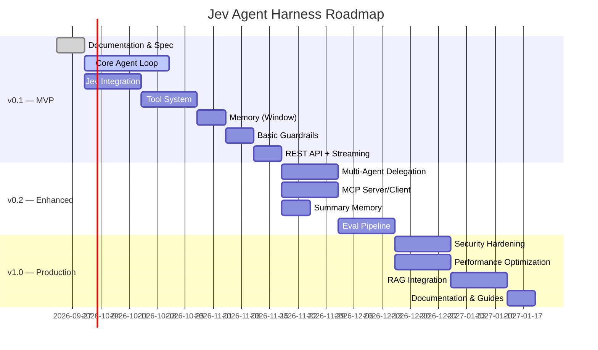

# Product Requirements Document — Jev Agent Harness

> **Version:** 0.1.0-draft  
> **Last Updated:** 2026-09-23  
> **Status:** Draft  
> **Owner:** Arunagirinathan K  
> **Companion Documents:** [SRS.md](SRS.md) · [TECH_STACK.md](TECH_STACK.md) · [AGENT.md](AGENT.md) · [ARCHITECTURE.md](ARCHITECTURE.md) · [IMPLEMENTATION_PLAN.md](IMPLEMENTATION_PLAN.md)

---

## 1. Executive Summary

The **Jev Agent Harness** is a Java Spring Boot framework that enables engineering teams to build **production-grade, autonomous AI agents**. It combines the open-ended reasoning capabilities of large language models (via Spring AI 2.0) with the fast, deterministic decision-making of **Jev** — TypeSafe AI's System One model — to create agents that are faster, cheaper, and more reliable than LLM-only approaches.

The harness provides the operational infrastructure — tool management, memory, guardrails, observability, and orchestration — so developers can focus on agent logic rather than plumbing.

---

## 2. Problem Statement

### Current Gaps

1. **No opinionated Java agent framework.** Python dominates the AI agent ecosystem (LangChain, CrewAI, AutoGen). Java teams are forced to build bespoke scaffolding or port Python patterns that don't align with Spring conventions.

2. **LLM-only agents are expensive and slow.** Using a large generative model for every decision — including simple routing, classification, and yes/no gating — wastes tokens, adds latency (1–30s per call), and introduces hallucination risk where none is needed.

3. **Prototype-to-production gap.** Most agent demos work in notebooks but fail in production due to missing guardrails, no observability, unmanaged state, and no graceful degradation.

4. **Tool and memory fragmentation.** Developers re-invent tool registries, memory backends, and context management for every new agent project.

### How This Framework Solves Them

| Gap | Solution |
|:---|:---|
| No Java agent framework | Spring Boot-native, advisor-driven harness with `@Tool`, memory SPIs, and auto-configuration |
| Expensive LLM decisions | Jev handles routing/classification in 70–500ms at a fraction of LLM cost |
| Prototype-to-production | Built-in guardrails, OpenTelemetry tracing, graceful degradation, and evaluation hooks |
| Tool/memory fragmentation | Reusable `ToolRegistry`, pluggable `ChatMemory`, and standardized `GuardrailChain` |

---

## 3. Target Audience

### Primary Personas

#### 3.1 Agent Developer
- **Role:** Writes agent logic, defines tools, configures behavior
- **Needs:** Clear APIs, annotation-driven tool creation, testable components, good error messages
- **Pain Points:** Boilerplate for tool schemas, manual context management, debugging opaque agent traces

#### 3.2 Platform Engineer
- **Role:** Deploys, scales, and monitors the harness in production
- **Needs:** Docker/K8s support, health checks, metrics dashboards, configuration via environment variables
- **Pain Points:** Lack of observability, no structured logging, unclear resource consumption patterns

#### 3.3 Security Reviewer
- **Role:** Audits agent behavior for policy compliance and risk
- **Needs:** Guardrail audit logs, permission model documentation, secret management guidance
- **Pain Points:** Agents with unbounded tool access, no record of what actions were taken and why

#### 3.4 AI/ML Engineer
- **Role:** Tunes prompts, evaluates agent quality, selects models
- **Needs:** Eval framework integration, A/B testing hooks, prompt versioning, Jev question design guidance
- **Pain Points:** No trajectory-level evaluation, hard to compare Jev vs. LLM decision quality

---

## 4. Goals & Non-Goals

### 4.1 Goals

| ID | Goal |
|:---|:---|
| G-01 | Provide a **Spring-native, annotation-driven** framework for building AI agents |
| G-02 | Integrate **Jev as a first-class decision layer** for routing, classification, risk-gating, and evaluation |
| G-03 | Offer **type-safe tool interfaces** with schema validation and argument augmentation |
| G-04 | Implement **composable memory** with window, summary, and persistent strategies |
| G-05 | Enforce **multi-stage guardrails** that can leverage Jev's probabilistic gating |
| G-06 | Deliver **observability-first** design with traces, metrics, and structured logs for every agent step |
| G-07 | Support **streaming** (SSE/WebSocket) for real-time agent responses |
| G-08 | Provide **graceful degradation** when Jev or LLM providers are unavailable |

### 4.2 Non-Goals

| ID | Non-Goal | Rationale |
|:---|:---|:---|
| NG-01 | Build a UI framework | The harness is a backend framework; UIs are consumer-specific |
| NG-02 | Train or fine-tune models | Jev and LLMs are consumed as external APIs |
| NG-03 | Python interop layer | Out of scope; the value proposition is Java-native |
| NG-04 | Replace Spring AI | The harness builds *on top of* Spring AI 2.0, not around it |
| NG-05 | General-purpose workflow engine | The harness is purpose-built for AI agent loops, not arbitrary DAGs |

---

## 5. Core Features (P0 — Must Have for MVP)

### F-01: Agent Execution Loop
The harness provides a **Reason → Act → Observe → Evaluate** loop that drives agent behavior. The loop:
- Sends the current state + prompt to the LLM via Spring AI's `ChatClient`
- Parses the LLM's response for tool calls
- Executes tool calls through the `ToolRegistry`
- Feeds results back to the LLM
- Repeats until the LLM signals completion or a max-iteration limit is reached

### F-02: Jev Decision Layer
At configurable decision points in the agent loop, the harness invokes Jev for:
- **Intent Classification** — Categorize user input before routing to the LLM
- **Model Routing** — Select the optimal LLM (e.g., GPT-4o for complex reasoning, GPT-4o-mini for simple tasks)
- **Tool-Risk Gating** — Evaluate whether a tool call (e.g., `database:delete`) is safe to execute
- **Output Evaluation** — Assess the quality/safety of the agent's response before returning it
- **Loop Termination** — Decide whether the agent has achieved its goal or should continue

### F-03: Type-Safe Tool System
- Tools are defined via `@Tool`-annotated Java methods
- Tool schemas are auto-generated from method signatures
- Input validation enforces type constraints before execution
- Argument augmentation captures LLM reasoning alongside tool arguments
- Tool results are serialized back to the LLM as structured messages

### F-04: Conversation Memory
- **Window Memory** — Retains the last N messages
- **Summary Memory** — Compacts older messages into summaries
- **Persistent Memory** — Stores full conversation history in a database
- Configurable via `harness.memory.*` properties
- Pluggable storage backends (in-memory, JDBC, Redis)

### F-05: Structured Output
- LLM responses can be constrained to JSON schemas
- Spring AI's structured output support with type-safe deserialization
- Jev responses are always structured (Choice, Score, Noul)

### F-06: Streaming Responses
- SSE endpoint for streaming agent text and tool-call status
- WebSocket endpoint for bidirectional communication
- Real-time indicators (e.g., "Calling get_weather...", "Evaluating response...")

---

## 6. Extended Features (P1 — Post-MVP)

### F-07: Multi-Agent Delegation
- **Orchestrator-Worker** — A coordinator agent delegates sub-tasks to specialist agents
- **Chain** — Sequential handoff between agents
- **Parallelization** — Concurrent execution with result aggregation
- **Evaluator-Optimizer** — One agent generates, another evaluates and requests improvements

### F-08: Model Context Protocol (MCP)
- Harness can act as an **MCP Server** (exposing tools, resources, prompts)
- Harness can act as an **MCP Client** (consuming external MCP servers)
- `@McpTool`, `@McpResource`, `@McpPrompt` annotations for Spring services

### F-09: Automated Evaluation Pipeline
- Trajectory-level evaluation (not just final output)
- Jev-as-a-Judge for automated quality scoring
- Regression test generation from production failures
- Integration with eval frameworks (e.g., Promptfoo, custom)

### F-10: RAG Integration
- Vector store integration via Spring AI's `VectorStore` SPI
- Document ingestion pipeline
- Retrieval-augmented generation advisor in the ChatClient chain

---

## 7. Success Metrics

| Metric | Target | Measurement |
|:---|:---|:---|
| **Jev Decision Latency** | ≤ 500ms p99 | OpenTelemetry span duration for Jev calls |
| **Agent Task Completion Rate** | ≥ 85% for defined benchmarks | Eval pipeline pass rate |
| **Token Cost Reduction** | ≥ 40% vs. LLM-only routing | Compare token usage with/without Jev routing |
| **Tool Call Success Rate** | ≥ 95% | Ratio of successful vs. failed tool invocations |
| **Developer Onboarding Time** | ≤ 2 hours to first working agent | Measured via user study |
| **Guardrail Violation Rate** | ≤ 2% of total agent runs | Post-action guardrail trigger count |

---

## 8. Risks & Mitigations

| Risk | Severity | Mitigation |
|:---|:---|:---|
| **Jev API unavailability** | High | `FallbackJevClient` routes decisions to LLM-based classification; circuit breaker with Resilience4j |
| **Context window exhaustion** | Medium | Summary memory compaction; configurable max context tokens; truncation with warning |
| **Infinite tool-call loops** | High | `harness.agent.max-iterations` config (default: 10); Jev loop-termination evaluation |
| **LLM provider outage** | High | Multi-provider failover via Spring AI model abstraction |
| **Prompt injection attacks** | High | Pre-LLM guardrail with input sanitization; Jev-based injection detection |
| **Excessive cost from token usage** | Medium | Token budgets per agent run; Jev routing to cheaper models for simple tasks |
| **Sensitive data leakage** | High | PII redaction guardrail; no secrets in logs; audit trail for all tool calls |

---

## 9. Release Roadmap

### Milestone Summary

| Version | Target | Key Deliverables |
|:---|:---|:---|
| **v0.1** | MVP | Single agent loop, Jev routing, `@Tool`, window memory, basic guardrails, REST API, SSE streaming |
| **v0.2** | Enhanced | Multi-agent delegation, MCP support, summary memory, eval pipeline |
| **v1.0** | Production | Security hardening, performance optimization, RAG, comprehensive documentation |

---

## 10. Appendix

### A. Glossary

| Term | Definition |
|:---|:---|
| **Jev** | TypeSafe AI's System One model for structured decision-making (routing, classification, gating) |
| **System One** | Fast, intuitive decision model (Kahneman) — Jev's design philosophy |
| **System Two** | Slow, deliberative reasoning — the role of traditional LLMs |
| **Choice** | Jev primitive: pick one option from a defined set, with probabilities |
| **Score** | Jev primitive: rate input on a rubric scale, with confidence |
| **Noul** | Jev primitive: calibrated yes/no probability (0.0 to 1.0) |
| **Advisor** | Spring AI 2.0 component that intercepts and transforms ChatClient requests/responses |
| **Tool** | A function the agent can invoke to interact with external systems |
| **MCP** | Model Context Protocol — standardized interface for AI tool/resource discovery |
| **Guardrail** | A validation check that prevents unsafe or policy-violating agent behavior |
| **Agent Loop** | The Reason → Act → Observe → Evaluate cycle that drives agent behavior |

### B. References

- [Spring AI Documentation](https://spring.io/projects/spring-ai)
- [TypeSafe AI — Jev](https://typesafe.ai/)
- [Spring AI 2.0 Release Notes](https://spring.io/blog)
- [Model Context Protocol Specification](https://modelcontextprotocol.io/)
- [Daniel Kahneman — Thinking, Fast and Slow](https://en.wikipedia.org/wiki/Thinking,_Fast_and_Slow)
