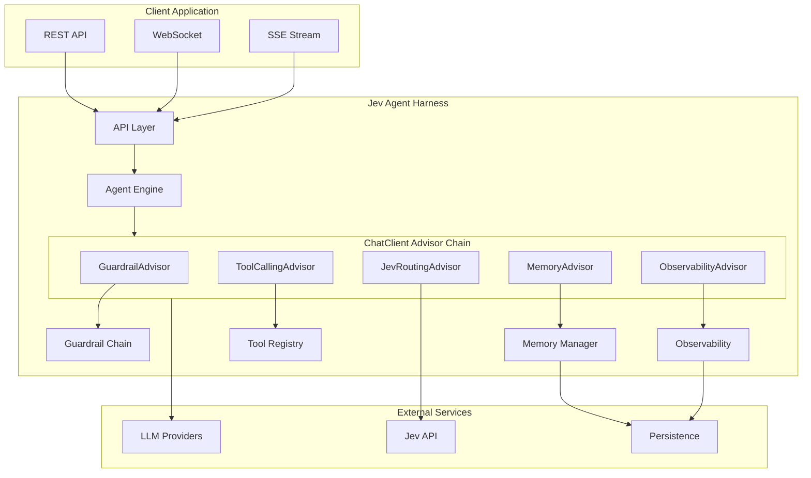
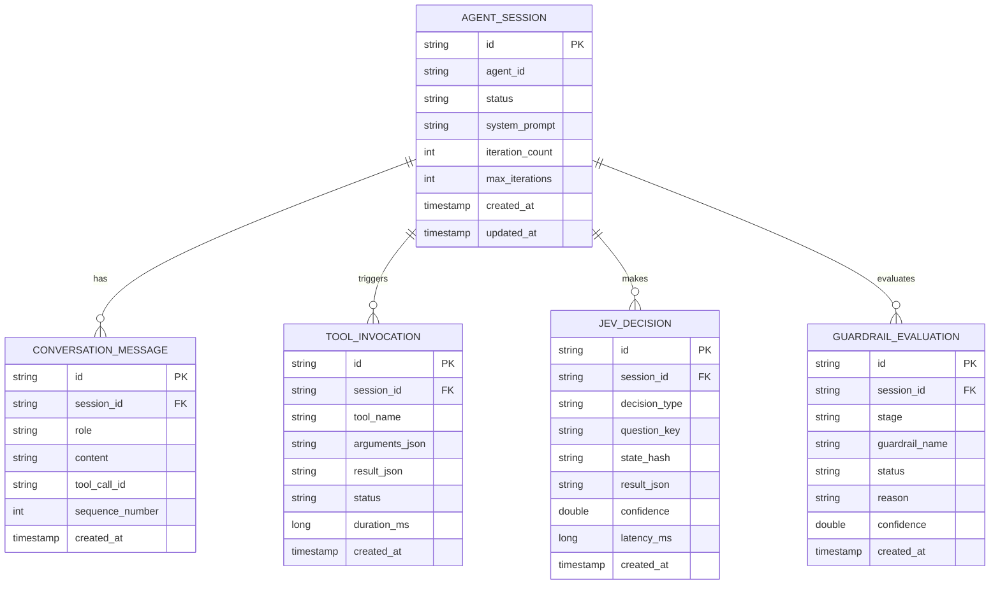

# Software Requirements Specification — Jev Agent Harness

> **Version:** 0.1.0-draft  
> **Last Updated:** 2026-09-23  
> **Status:** Draft  
> **Companion Documents:** [PRD.md](PRD.md) · [TECH_STACK.md](TECH_STACK.md) · [ARCHITECTURE.md](ARCHITECTURE.md) · [AGENT.md](AGENT.md)

---

## Table of Contents

1. [Scope & Purpose](#1-scope--purpose)
2. [Definitions & Glossary](#2-definitions--glossary)
3. [System Overview](#3-system-overview)
4. [Functional Requirements](#4-functional-requirements)
5. [Non-Functional Requirements](#5-non-functional-requirements)
6. [Data Model](#6-data-model)
7. [API Specification](#7-api-specification)
8. [Error Handling & Recovery](#8-error-handling--recovery)
9. [External Interfaces](#9-external-interfaces)
10. [Constraints & Assumptions](#10-constraints--assumptions)

---

## 1. Scope & Purpose

This document specifies the **functional and non-functional requirements** for the Jev Agent Harness — a Java Spring Boot framework for building LLM-powered AI agents with Jev-based decision intelligence.

### 1.1 In Scope

- Agent execution lifecycle and loop management
- LLM integration via Spring AI 2.0 ChatClient
- Jev (TypeSafe AI) integration for structured decisions
- Tool registration, validation, and execution
- Conversation memory management
- Guardrail pipeline
- Streaming (SSE/WebSocket)
- Observability (traces, metrics, logs)
- REST API for agent invocation
- Configuration and auto-configuration

### 1.2 Out of Scope

- Frontend/UI components
- Model training or fine-tuning
- Python or other language SDKs
- Infrastructure provisioning (Terraform, CloudFormation)

---

## 2. Definitions & Glossary

| Term | Definition |
|:---|:---|
| **Agent** | An autonomous software entity that uses an LLM for reasoning and tools for action to accomplish a user-defined goal |
| **Agent Loop** | The iterative Reason → Act → Observe → Evaluate cycle that drives agent behavior |
| **Advisor** | A Spring AI 2.0 component in the `ChatClient` chain that intercepts/transforms requests and responses |
| **ChatClient** | Spring AI 2.0's primary interface for interacting with LLMs |
| **Choice** | Jev decision primitive: selects one option from a defined set with per-option probabilities |
| **Score** | Jev decision primitive: rates input on a defined rubric scale with confidence |
| **Noul** | Jev decision primitive: returns a calibrated yes/no probability (0.0 to 1.0) |
| **Guardrail** | A validation stage that prevents unsafe, policy-violating, or low-quality agent behavior |
| **Harness** | The operational infrastructure wrapping the LLM — tools, memory, guardrails, observability |
| **Jev** | TypeSafe AI's System One model optimized for fast, structured decision-making |
| **MCP** | Model Context Protocol — a standardized interface for AI tool/resource discovery |
| **System One** | Fast, intuitive, deterministic decisions (Jev's domain) |
| **System Two** | Slow, deliberative, open-ended reasoning (LLM's domain) |
| **Tool** | A function the agent can invoke to interact with external systems or compute results |
| **Trajectory** | The full sequence of steps (reasoning, tool calls, observations) an agent takes to complete a task |

---

## 3. System Overview



---

## 4. Functional Requirements

### FR-01: Agent Lifecycle Management

| Attribute | Value |
|:---|:---|
| **ID** | FR-01 |
| **Priority** | P0 |
| **Description** | The system SHALL support complete agent lifecycle management |

**Requirements:**

| ID | Requirement |
|:---|:---|
| FR-01.1 | The system SHALL support creating an agent instance with a unique identifier, system prompt, tool set, and configuration |
| FR-01.2 | The system SHALL support the following agent states: `IDLE`, `PLANNING`, `ACTING`, `OBSERVING`, `EVALUATING`, `PAUSED`, `COMPLETED`, `FAILED`, `CANCELLED` |
| FR-01.3 | The system SHALL enforce valid state transitions as defined in [AGENT.md — Agent Lifecycle](AGENT.md) |
| FR-01.4 | The system SHALL support pausing and resuming an in-progress agent execution |
| FR-01.5 | The system SHALL support cancellation of an in-progress agent execution with cleanup of resources |
| FR-01.6 | The system SHALL enforce a configurable maximum iteration limit (`harness.agent.max-iterations`, default: 10) to prevent infinite loops |
| FR-01.7 | The system SHALL emit a lifecycle event for every state transition, observable via the event bus and traces |

---

### FR-02: LLM Integration

| Attribute | Value |
|:---|:---|
| **ID** | FR-02 |
| **Priority** | P0 |
| **Description** | The system SHALL integrate with LLM providers via Spring AI 2.0 |

**Requirements:**

| ID | Requirement |
|:---|:---|
| FR-02.1 | The system SHALL use Spring AI 2.0's `ChatClient` as the primary interface for LLM communication |
| FR-02.2 | The system SHALL support at least the following LLM providers via Spring AI auto-configuration: OpenAI, Anthropic, Google Vertex AI, Azure OpenAI, Ollama |
| FR-02.3 | The system SHALL support model selection via configuration (`spring.ai.*.model`) and via runtime Jev-based routing |
| FR-02.4 | The system SHALL support both synchronous and streaming LLM responses |
| FR-02.5 | The system SHALL handle LLM provider errors (timeout, rate-limit, auth failure) with configurable retry and fallback behavior |
| FR-02.6 | The system SHALL support structured output generation via Spring AI's JSON schema constraints |
| FR-02.7 | The system SHALL track token usage (prompt tokens, completion tokens, total tokens) per agent execution |

---

### FR-03: Jev Integration

| Attribute | Value |
|:---|:---|
| **ID** | FR-03 |
| **Priority** | P0 |
| **Description** | The system SHALL integrate with TypeSafe AI's Jev System One API for structured decision-making |

**Requirements:**

| ID | Requirement |
|:---|:---|
| FR-03.1 | The system SHALL provide a `JevClient` interface with methods for each decision primitive: `choice()`, `score()`, `noul()` |
| FR-03.2 | The system SHALL call the TypeSafe AI API endpoint (`POST https://api.typesafe.ai/v1/systemone`) with model, state, and questions |
| FR-03.3 | The system SHALL support the `jev-latest` model identifier and allow override via `jev.model` configuration |
| FR-03.4 | The system SHALL support **Choice** decisions: given a state and a set of labeled options (each with description), return the selected option and per-option probabilities |
| FR-03.5 | The system SHALL support **Score** decisions: given a state and a scoring rubric, return a probability-weighted position on the rubric |
| FR-03.6 | The system SHALL support **Noul** decisions: given a state and a yes/no question, return a calibrated probability between 0.0 and 1.0 |
| FR-03.7 | The system SHALL authenticate with the Jev API using a Bearer token configured via `jev.api-key` |
| FR-03.8 | The system SHALL implement a `FallbackJevClient` that routes Jev decisions to the configured LLM when the Jev API is unavailable |
| FR-03.9 | The system SHALL implement circuit breaker logic (via Resilience4j or equivalent) for Jev API calls |
| FR-03.10 | The system SHALL provide a `CachingJevClient` decorator that memoizes identical decisions for configurable duration |

**Decision Point Integration:**

| Decision Point | Primitive | Purpose |
|:---|:---|:---|
| Intent Classification | Choice | Categorize user input into predefined intent categories |
| Model Routing | Choice | Select optimal LLM based on task complexity/type |
| Tool-Risk Gating | Noul | Evaluate safety of a proposed tool call (probability of risk) |
| Output Quality | Score | Rate the quality of agent's response on a rubric |
| Loop Termination | Noul | Assess whether the agent has achieved its goal |
| Guardrail Violation | Noul | Detect policy violations in input or output |

---

### FR-04: Tool Management

| Attribute | Value |
|:---|:---|
| **ID** | FR-04 |
| **Priority** | P0 |
| **Description** | The system SHALL provide a type-safe tool registration and execution system |

**Requirements:**

| ID | Requirement |
|:---|:---|
| FR-04.1 | The system SHALL discover tools via classpath scanning of `@Tool`-annotated methods on Spring beans |
| FR-04.2 | The system SHALL auto-generate JSON Schema descriptions for each tool from its method signature (name, parameters, return type, Javadoc) |
| FR-04.3 | The system SHALL validate tool call arguments against the schema before execution |
| FR-04.4 | The system SHALL execute tool calls within a managed context that captures timing, input, output, and errors |
| FR-04.5 | The system SHALL support the `ToolArgumentAugmenter` SPI for capturing LLM reasoning alongside tool arguments |
| FR-04.6 | The system SHALL provide a `ToolRegistry` that supports runtime registration and deregistration of tools |
| FR-04.7 | The system SHALL support tool-level permission annotations (e.g., `@Tool(requiresApproval = true)`) for human-in-the-loop flows |
| FR-04.8 | The system SHALL serialize tool results as structured messages for the LLM to consume |
| FR-04.9 | The system SHALL support the `ToolSearchToolCallingAdvisor` for progressive tool disclosure when the registered tool count exceeds a configurable threshold |
| FR-04.10 | Tool execution SHALL be timeout-protected with a configurable per-tool timeout (`harness.tools.default-timeout`, default: 30s) |

---

### FR-05: Memory Management

| Attribute | Value |
|:---|:---|
| **ID** | FR-05 |
| **Priority** | P0 |
| **Description** | The system SHALL manage conversation memory with configurable retention strategies |

**Requirements:**

| ID | Requirement |
|:---|:---|
| FR-05.1 | The system SHALL implement the Spring AI `ChatMemory` SPI for memory management |
| FR-05.2 | The system SHALL provide **Window Memory**: retains the last N messages (configurable via `harness.memory.window-size`, default: 20) |
| FR-05.3 | The system SHALL provide **Summary Memory**: compacts messages older than the window into an LLM-generated summary |
| FR-05.4 | The system SHALL provide **Persistent Memory**: stores complete conversation history in a pluggable backend |
| FR-05.5 | The system SHALL support the following storage backends: In-Memory (default), JDBC (PostgreSQL, MySQL), Redis |
| FR-05.6 | The system SHALL associate memory with a `conversationId` to support multi-session isolation |
| FR-05.7 | The system SHALL provide a `MessageChatMemoryAdvisor` that automatically injects history into ChatClient requests |
| FR-05.8 | The system SHALL support configurable token budgets for memory context (`harness.memory.max-tokens`, default: 4096) |
| FR-05.9 | The system SHALL support memory clearing and selective message deletion via API |

---

### FR-06: Guardrail Pipeline

| Attribute | Value |
|:---|:---|
| **ID** | FR-06 |
| **Priority** | P0 |
| **Description** | The system SHALL enforce multi-stage guardrails for safety and policy compliance |

**Requirements:**

| ID | Requirement |
|:---|:---|
| FR-06.1 | The system SHALL implement a `GuardrailChain` with ordered validation stages |
| FR-06.2 | The system SHALL support the following guardrail stages: `PRE_INPUT`, `PRE_LLM`, `POST_LLM`, `PRE_ACTION`, `POST_ACTION` |
| FR-06.3 | Each guardrail stage SHALL be implemented as a `GuardrailAdvisor` in the ChatClient advisor chain |
| FR-06.4 | The system SHALL provide built-in guardrails for: input length validation, PII redaction, prompt injection detection, output format validation, tool-call risk gating |
| FR-06.5 | Guardrails SHALL be able to invoke Jev Noul decisions for probabilistic gating (e.g., "Is this input a prompt injection?" → probability threshold) |
| FR-06.6 | Each guardrail SHALL produce a `GuardrailResult` with status (`PASS`, `WARN`, `BLOCK`), reason, and confidence score |
| FR-06.7 | A `BLOCK` result SHALL short-circuit the advisor chain and return a safe error response to the client |
| FR-06.8 | All guardrail evaluations SHALL be logged to the audit trail with full context |
| FR-06.9 | Guardrails SHALL be configurable via `harness.guardrails.*` properties (enable/disable individual guardrails, set thresholds) |

---

### FR-07: Structured Output

| Attribute | Value |
|:---|:---|
| **ID** | FR-07 |
| **Priority** | P0 |
| **Description** | The system SHALL support constrained, type-safe LLM output |

**Requirements:**

| ID | Requirement |
|:---|:---|
| FR-07.1 | The system SHALL leverage Spring AI's structured output support to constrain LLM responses to JSON schemas |
| FR-07.2 | The system SHALL support mapping LLM responses directly to Java records/POJOs |
| FR-07.3 | Jev responses SHALL always be structured (Choice, Score, Noul) and SHALL be deserialized to typed Java objects |
| FR-07.4 | The system SHALL validate structured output against the declared schema and retry on validation failure (configurable max retries) |

---

### FR-08: Streaming

| Attribute | Value |
|:---|:---|
| **ID** | FR-08 |
| **Priority** | P0 |
| **Description** | The system SHALL support real-time streaming of agent responses |

**Requirements:**

| ID | Requirement |
|:---|:---|
| FR-08.1 | The system SHALL provide an SSE endpoint (`/api/v1/agents/{id}/stream`) for streaming agent text responses |
| FR-08.2 | The system SHALL provide a WebSocket endpoint (`/ws/agents/{id}`) for bidirectional agent communication |
| FR-08.3 | Stream events SHALL include: `TEXT_DELTA`, `TOOL_CALL_START`, `TOOL_CALL_RESULT`, `JEV_DECISION`, `GUARDRAIL_CHECK`, `AGENT_COMPLETE`, `AGENT_ERROR` |
| FR-08.4 | The system SHALL support backpressure handling to prevent client overwhelm |
| FR-08.5 | Stream connections SHALL support automatic reconnection with resume tokens |

---

### FR-09: Observability

| Attribute | Value |
|:---|:---|
| **ID** | FR-09 |
| **Priority** | P0 |
| **Description** | The system SHALL provide comprehensive observability for agent execution |

**Requirements:**

| ID | Requirement |
|:---|:---|
| FR-09.1 | The system SHALL emit **OpenTelemetry traces** with one span per agent step (LLM call, Jev decision, tool execution, guardrail check) |
| FR-09.2 | The system SHALL emit **Micrometer metrics**: `harness.agent.executions` (counter), `harness.agent.duration` (timer), `harness.agent.iterations` (distribution), `harness.jev.latency` (timer), `harness.tool.executions` (counter), `harness.guardrail.blocks` (counter) |
| FR-09.3 | The system SHALL produce **structured JSON logs** for every agent event with correlation IDs |
| FR-09.4 | The system SHALL support trace context propagation across async boundaries (agent loop, streaming) |
| FR-09.5 | The system SHALL provide a `/actuator/health/jev` health indicator for Jev API connectivity |
| FR-09.6 | The system SHALL record the full agent **trajectory** (reasoning steps, tool calls, decisions) for post-hoc analysis |

---

### FR-10: Configuration

| Attribute | Value |
|:---|:---|
| **ID** | FR-10 |
| **Priority** | P0 |
| **Description** | The system SHALL be fully configurable via Spring Boot conventions |

**Requirements:**

| ID | Requirement |
|:---|:---|
| FR-10.1 | The system SHALL support configuration via `application.yml`, `application.properties`, environment variables, and Spring Cloud Config |
| FR-10.2 | All configuration properties SHALL use the following namespace prefixes: `jev.*`, `harness.agent.*`, `harness.memory.*`, `harness.guardrails.*`, `harness.tools.*`, `harness.observability.*` |
| FR-10.3 | The system SHALL provide sensible defaults for all configuration properties |
| FR-10.4 | The system SHALL provide a configuration metadata file (`spring-configuration-metadata.json`) for IDE auto-completion |
| FR-10.5 | The system SHALL validate configuration at startup and fail fast with descriptive error messages for invalid configurations |

---

## 5. Non-Functional Requirements

### NFR-01: Performance & Latency

| ID | Requirement |
|:---|:---|
| NFR-01.1 | Jev decision calls SHALL complete in ≤ 500ms at p99 |
| NFR-01.2 | Tool schema validation SHALL complete in ≤ 10ms at p99 |
| NFR-01.3 | Memory retrieval (window mode) SHALL complete in ≤ 50ms at p99 |
| NFR-01.4 | Guardrail chain evaluation (excluding Jev calls) SHALL complete in ≤ 100ms at p99 |
| NFR-01.5 | End-to-end harness overhead (excluding LLM and Jev latency) SHALL be ≤ 200ms at p95 |
| NFR-01.6 | The system SHALL support at least 50 concurrent agent sessions on a single instance |

---

### NFR-02: Reliability & Availability

| ID | Requirement |
|:---|:---|
| NFR-02.1 | The system SHALL gracefully degrade if the Jev API is unavailable, routing decisions to the configured LLM |
| NFR-02.2 | The system SHALL implement circuit breaker logic for all external service calls (Jev, LLM providers) |
| NFR-02.3 | The system SHALL retry failed Jev/LLM calls with exponential backoff (configurable: max retries, initial delay, multiplier) |
| NFR-02.4 | Agent state SHALL be recoverable after a harness restart (for persistent memory configurations) |
| NFR-02.5 | The system SHALL NOT lose tool call results due to transient failures; results SHALL be cached locally until acknowledged |

---

### NFR-03: Security

| ID | Requirement |
|:---|:---|
| NFR-03.1 | API keys (Jev, LLM providers) SHALL be stored via environment variables, Spring Vault, or Kubernetes secrets — never in source code or logs |
| NFR-03.2 | The system SHALL support endpoint authentication via API key and/or OAuth2/OIDC |
| NFR-03.3 | The system SHALL redact sensitive data (API keys, PII) from all log output |
| NFR-03.4 | Tool execution SHALL respect role-based access control (RBAC) when configured |
| NFR-03.5 | The system SHALL maintain an audit log of all tool calls, Jev decisions, and guardrail evaluations |
| NFR-03.6 | The system SHALL support TLS for all external API communication |

---

### NFR-04: Extensibility

| ID | Requirement |
|:---|:---|
| NFR-04.1 | Developers SHALL be able to register custom `Advisor` implementations in the ChatClient chain without modifying framework code |
| NFR-04.2 | Developers SHALL be able to implement custom `ChatMemory` backends by implementing the SPI |
| NFR-04.3 | Developers SHALL be able to implement custom guardrails by implementing the `Guardrail` interface |
| NFR-04.4 | The system SHALL support custom `JevClient` implementations for testing and alternative providers |
| NFR-04.5 | The tool system SHALL support dynamic registration/deregistration at runtime |
| NFR-04.6 | All framework components SHALL be accessible as Spring beans, overridable via `@Bean` declarations |

---

### NFR-05: Testability

| ID | Requirement |
|:---|:---|
| NFR-05.1 | The system SHALL provide `MockJevClient` and `MockChatModel` implementations for unit testing |
| NFR-05.2 | The system SHALL provide a `@HarnessTest` annotation for integration test bootstrapping |
| NFR-05.3 | The system SHALL support WireMock stubs for Jev API responses in integration tests |
| NFR-05.4 | The system SHALL support TestContainers configurations for database-backed memory testing |
| NFR-05.5 | Every public API SHALL have documented test examples in Javadoc |

---

## 6. Data Model

### 6.1 Core Entities



### 6.2 Agent State Enum

```
IDLE → PLANNING → ACTING → OBSERVING → EVALUATING → COMPLETED
                                                    → FAILED
                                                    → PAUSED → (resume) → PLANNING
                                    → CANCELLED
```

---

## 7. API Specification

### 7.1 REST Endpoints

| Method | Path | Description | Request Body | Response |
|:---|:---|:---|:---|:---|
| `POST` | `/api/v1/agents` | Create and start an agent session | `AgentRequest` | `AgentSession` |
| `GET` | `/api/v1/agents/{id}` | Get agent session status | — | `AgentSession` |
| `GET` | `/api/v1/agents/{id}/history` | Get conversation history | — | `List<Message>` |
| `GET` | `/api/v1/agents/{id}/trajectory` | Get full execution trajectory | — | `Trajectory` |
| `POST` | `/api/v1/agents/{id}/messages` | Send a follow-up message | `MessageRequest` | `AgentResponse` |
| `POST` | `/api/v1/agents/{id}/pause` | Pause agent execution | — | `AgentSession` |
| `POST` | `/api/v1/agents/{id}/resume` | Resume paused agent | — | `AgentSession` |
| `DELETE` | `/api/v1/agents/{id}` | Cancel and cleanup agent session | — | `204 No Content` |

### 7.2 Streaming Endpoints

| Protocol | Path | Description |
|:---|:---|:---|
| SSE | `/api/v1/agents/{id}/stream` | Server-Sent Events stream of agent output |
| WebSocket | `/ws/agents/{id}` | Bidirectional agent communication channel |

### 7.3 Management Endpoints

| Method | Path | Description |
|:---|:---|:---|
| `GET` | `/actuator/health/jev` | Jev API health check |
| `GET` | `/actuator/health/llm` | LLM provider health check |
| `GET` | `/actuator/metrics/harness.*` | Harness-specific metrics |

### 7.4 Request/Response DTOs

#### AgentRequest
```json
{
  "systemPrompt": "You are a helpful assistant...",
  "userMessage": "What's the weather in London?",
  "model": "gpt-4o",
  "tools": ["get_weather", "search_web"],
  "config": {
    "maxIterations": 10,
    "memoryStrategy": "WINDOW",
    "enableJevRouting": true,
    "enableGuardrails": true
  }
}
```

#### AgentResponse
```json
{
  "sessionId": "sess_abc123",
  "status": "COMPLETED",
  "response": "The current weather in London is 15°C with light rain.",
  "trajectory": {
    "iterations": 2,
    "toolCalls": [
      {
        "tool": "get_weather",
        "args": {"city": "London"},
        "result": {"temp": 15, "condition": "light rain"},
        "durationMs": 230
      }
    ],
    "jevDecisions": [
      {
        "type": "CHOICE",
        "key": "model_routing",
        "result": "gpt-4o-mini",
        "confidence": 0.92
      }
    ]
  },
  "usage": {
    "promptTokens": 450,
    "completionTokens": 38,
    "totalTokens": 488,
    "jevCalls": 1
  }
}
```

---

## 8. Error Handling & Recovery

### 8.1 Error Taxonomy

| Error Code | Category | Description | Recovery |
|:---|:---|:---|:---|
| `HARNESS-001` | LLM Timeout | LLM provider did not respond within timeout | Retry with exponential backoff; failover to alternate provider |
| `HARNESS-002` | LLM Rate Limit | LLM provider returned 429 | Retry after `Retry-After` header; queue request |
| `HARNESS-003` | LLM Auth Failure | Invalid or expired LLM API key | Fail fast; log and alert |
| `HARNESS-004` | Jev Unavailable | Jev API returned 5xx or timed out | Fallback to LLM-based classification via `FallbackJevClient` |
| `HARNESS-005` | Jev Auth Failure | Invalid Jev API key | Fail fast; log and alert |
| `HARNESS-006` | Tool Execution Error | Tool threw an exception | Serialize error to LLM; allow retry; fail after max retries |
| `HARNESS-007` | Tool Timeout | Tool did not complete within configured timeout | Cancel execution; serialize timeout to LLM |
| `HARNESS-008` | Guardrail Block | Input/output failed guardrail validation | Short-circuit; return safe error response to client |
| `HARNESS-009` | Context Overflow | Conversation exceeds max token budget | Trigger memory compaction; truncate oldest messages |
| `HARNESS-010` | Max Iterations | Agent reached `max-iterations` limit | Terminate loop; return partial result with warning |
| `HARNESS-011` | Invalid Config | Configuration validation failed at startup | Fail fast with descriptive message |

### 8.2 Retry Configuration

```yaml
harness:
  retry:
    llm:
      max-attempts: 3
      initial-delay: 1000ms
      multiplier: 2.0
      max-delay: 10000ms
    jev:
      max-attempts: 2
      initial-delay: 500ms
      multiplier: 2.0
      max-delay: 5000ms
    tools:
      max-attempts: 2
      initial-delay: 500ms
```

---

## 9. External Interfaces

### 9.1 TypeSafe AI Jev API

| Attribute | Value |
|:---|:---|
| **Protocol** | HTTPS |
| **Endpoint** | `POST https://api.typesafe.ai/v1/systemone` |
| **Authentication** | Bearer token (`jev.api-key`) |
| **Request Content-Type** | `application/json` |
| **Response Content-Type** | `application/json` |
| **Timeout** | Configurable (`jev.timeout`, default: 2000ms) |

#### Request Schema

```json
{
  "model": "jev-latest",
  "state": "<serialized agent state / context>",
  "questions": {
    "question_key": {
      "type": "choice|score|noul",
      "instructions": "Question text for Jev",
      "options": {
        "option_a": "Description of option A",
        "option_b": "Description of option B"
      }
    }
  }
}
```

#### Response Schema

```json
{
  "id": "dec_xxx",
  "model": "jev-latest",
  "decisions": {
    "question_key": {
      "type": "choice",
      "value": "option_a",
      "probabilities": {
        "option_a": 0.87,
        "option_b": 0.13
      }
    }
  },
  "usage": {
    "compute_units": 1
  }
}
```

### 9.2 LLM Providers

Accessed via Spring AI 2.0's model abstraction layer. Provider-specific configuration via `spring.ai.*` properties. See [Spring AI Documentation](https://spring.io/projects/spring-ai).

### 9.3 Persistence

Pluggable via Spring Data. Default: In-Memory. Supported: PostgreSQL (JDBC), Redis (Lettuce).

---

## 10. Constraints & Assumptions

### 10.1 Constraints

| ID | Constraint |
|:---|:---|
| C-01 | Java 21+ is required (virtual threads, pattern matching, records) |
| C-02 | Spring Boot 4.x / Spring Framework 7.x is the minimum supported platform |
| C-03 | Spring AI 2.0+ is required for advisor-driven architecture |
| C-04 | Jev API requires network access from the deployment environment |
| C-05 | LLM providers require network access and valid API keys |

### 10.2 Assumptions

| ID | Assumption |
|:---|:---|
| A-01 | Jev API maintains backward compatibility within the `v1` endpoint |
| A-02 | Spring AI 2.0's `ChatClient` advisor chain is the stable API for composing AI workflows |
| A-03 | Developers are familiar with Spring Boot conventions (auto-configuration, dependency injection) |
| A-04 | Production deployments will use containerized environments (Docker/Kubernetes) |
| A-05 | The primary interaction pattern is request-response with streaming, not long-running batch agents |

---

## Appendix: Traceability Matrix

| PRD Feature | SRS Requirement(s) |
|:---|:---|
| F-01: Agent Execution Loop | FR-01, FR-02 |
| F-02: Jev Decision Layer | FR-03 |
| F-03: Type-Safe Tool System | FR-04 |
| F-04: Conversation Memory | FR-05 |
| F-05: Structured Output | FR-07 |
| F-06: Streaming Responses | FR-08 |
| F-07: Multi-Agent Delegation | (P1 — future SRS revision) |
| F-08: MCP Support | (P1 — future SRS revision) |
| F-09: Eval Pipeline | (P1 — future SRS revision) |
| F-10: RAG Integration | (P1 — future SRS revision) |
